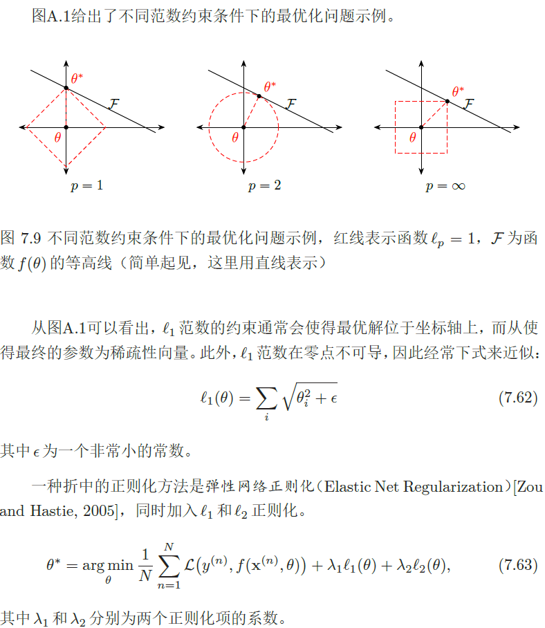
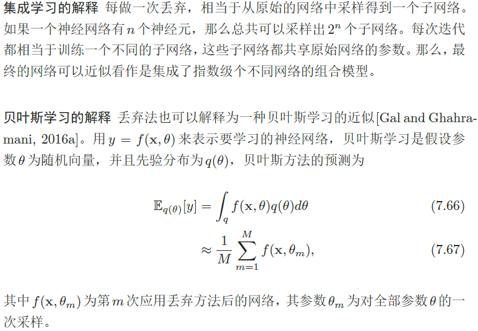
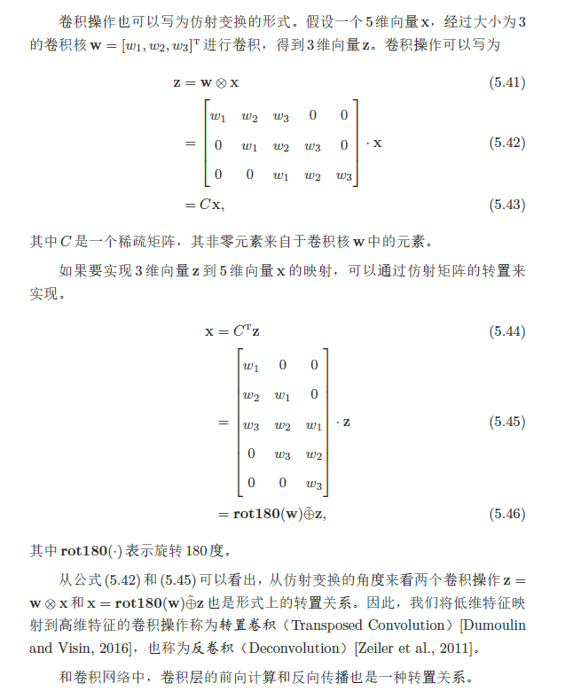
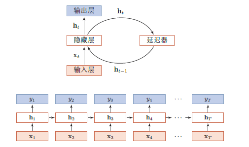
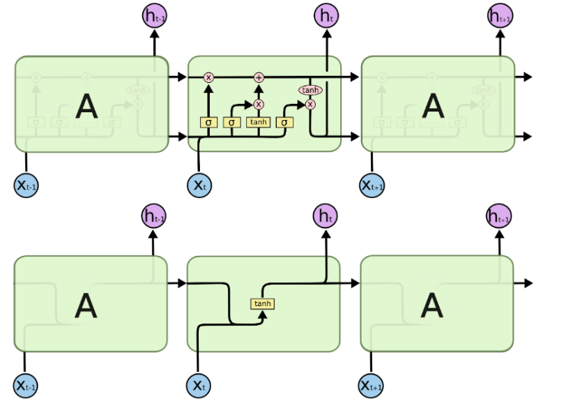

# 神经网络与深度学习

## 三要素

模型、学习准则、优化算法

## 神经网络的万能近似定理

一个前馈神经网络如果具有至少一个非线性输出层，那么只要给予网络足够数量的隐藏单元，它就可以以任意的精度来近似任何从一个有限维空间到另一个有限维空间的函数。

## 导数、偏导数、方向导数和梯度

- 导数：函数在某点的导数是函数在该点的瞬时变化率，几何上即该点切线的斜率
- 偏导数：函数在某点沿坐标轴方向的导数  
- 方向导数：函数在某点沿某一方向的导数（偏导数是方向导数沿坐标轴方向的特例）  
- 梯度：梯度是一个由函数对各坐标轴的偏导数组成的向量，方向导数可以写成梯度grad和单位方向向量l的内积,故当grad与l同方向时，方向导数取得最大值，故梯度的方向时方向导数取最大值时的方向，梯度的幅值是方向导数的最大值

## 偏差-方差分解

为了避免过拟合，我们经常会在模型的拟合能力和复杂度之间进行权衡。拟合能力强的模型一般复杂度会比较高，容易导致过拟合(泛化能力差)。相反，如果限制模型的复杂度，降低其拟合能力，又可能会导致欠拟合。因此，如何能在模型能力和复杂度之间取得一个较好的平衡对一个机器学习算法来说十分重要。偏差-方差分解(Bias-Variance Decomposition)分析和指导。


**==偏差表示模型的拟合能力，方差表示模型的泛化能力。==**


随着模型复杂度的增加，模型的拟合能力变强，偏差减少而方差增大，从而导致过拟合。以结构错误最小化为例，我们可以调整正则化系数λ 来控制模型的复杂度。当λ 变大时，模型复杂度会降低，可以有效地减少方差，避免过
结构错误最小化参见公式(2.27)。拟合，但偏差会上升。当λ过大时，总的期望错误反而会上升。因此，一个好的
正则化系数λ 需要在偏差和方差之间取得比较好的平衡。图2.7给出了机器学习模型的期望错误、偏差和方差随复杂度的变化情况。最优的模型并不一定是偏差曲线和方差曲线的交点。


偏差和方差分解给机器学习模型提供了一种分析途径，但在实际操作中难以直接衡量。一般来说，当一个模型在训练集上的错误率比较高时，说明模型的拟合能力不够，偏差比较高。这种情况可以增加数据特征、提高模型复杂度，减少正则化系数等操作来改进模型。当模型在训练集上的错误率比较低，但验证集上的错误率比较高时，说明模型过拟合，方差比较高。这种情况可以通过降低模型复杂度，加大正则化系数，引入先验等方法来缓解。此外，还有一种有效的降低方差的方法为集成模型，即通过多个高方差模型的平均来降低方差。

## 过拟合与欠拟合

**欠拟合**是指模型不能在**训练集**上获得足够低的训练误差(偏差大)

**过拟合**是指模型的**训练误差**与**测试误差**(泛化误差)之间差距过大(方差大);评价指标上，模型在训练集上表现良好，但是在测试集上和新数据上表现一般(泛化能力差)。

### 过拟合解决方法

所有为了减少测试误差的策略统称为**正则化方法**，这些方法可能会以增大训练误差为代价。

#### 数据增强

图像：平移、旋转、缩放

利用生成对抗网络(GAN)生成新数据

NLP:利用机器翻译生成新数据

#### 降低模型复杂度

神经网络：减少网络层，神经元个数

#### 正则项(权值约束)

L1正则

L2正则

#### Dropout

神经网络：**Dropout**

#### 提前终止

### 欠拟合解决方法

#### 加入新的特征

交叉特征：多项式特征                                                                                                                                                                                                                                                                                                                                                                                                                                                                                                                                                                                                                                                                                                                                                                                                                                                                                                                                                                                                                                                                                                                                                 

深度学习：因式分解机、自编码器

#### 增加模型复杂度

线性模型：添加高次项

神经网络：增加网络层数、神经元个数

#### 减小正则项的系数

添加正则项是为了限制模型的学习能力，减小正则化项的系数可以放宽这个限制

模型通常更倾向于更大的权重，更大的权重可以是模型更好的拟合数据

## 最小二乘估计

最小二乘的目的是最小化误差平方之和，从而找到最优训练模型，这个模型可以用来更好的拟合训练的样本数据。

最小二乘法具体包括的执行算法有：随机梯度下降和牛顿法。


## 激活函数

### 激活函数的作用

使用激活函数的目的是为了向网络中加入**非线性因素**；**加强网络的表示能力**，解决线性模型无法解决的问题。

加强网络的表示能力：**神经网络的万能近似定理**

神经网络具有至少一个非线性隐藏层，那么只要给予网络足够数量的隐藏单元，它就可以以任意的精度来近似任何从一个有限维空间到另一个有限维空间的函数。

### 激活函数的性质

激活函数：为了增强网络的表示能力和学习能力，激活函数应该具备以下这些性质

**1. 非线性：**即导数不是常数。保证多层网络不退化成单层线性网络。这也是激活函数的意义所在。

**2. 几乎处处可微：**可微性保证了在优化中梯度的可计算性。传统的激活函数如sigmoid等满足处处可微。对于分段线性函数比如ReLU，只满足几乎处处可微（即仅在有限个点处不可微）。对于SGD算法来说，由于几乎不可能收敛到梯度接近零的位置，有限的不可微点对于优化结果不会有很大影响。

**3. 计算简单：**正如题主所说，非线性函数有很多。极端的说，一个多层神经网络也可以作为一个非线性函数，类似于Network In Network[2]中把它当做卷积操作的做法。但激活函数在神经网络前向的计算次数与神经元的个数成正比，因此简单的非线性函数自然更适合用作激活函数。这也是ReLU之流比其它使用Exp等操作的激活函数更受欢迎的其中一个原因。

**4. 非饱和性（saturation）：**饱和指的是在某些区间梯度接近于零（即梯度消失），使得参数无法继续更新的问题。最经典的例子是Sigmoid，它的导数在x为比较大的正值和比较小的负值时都会接近于0。更极端的例子是阶跃函数，由于它在几乎所有位置的梯度都为0，因此处处饱和，无法作为激活函数。ReLU在x>0时导数恒为1，因此对于再大的正值也不会饱和。但同时对于x<0，其梯度恒为0，这时候它也会出现饱和的现象（在这种情况下通常称为dying ReLU）。Leaky ReLU和PReLU的提出正是为了解决这一问题。

**5. 单调性（monotonic）：**即导数符号不变。这个性质大部分激活函数都有，除了诸如sin、cos等。个人理解，单调性使得在激活函数处的梯度方向不会经常改变，从而让训练更容易收敛。

**6. 输出范围有限：**有限的输出范围使得网络对于一些比较大的输入也会比较稳定，这也是为什么早期的激活函数都以此类函数为主，如Sigmoid、TanH。但这导致了前面提到的梯度消失问题，而且强行让每一层的输出限制到固定范围会限制其表达能力。因此现在这类函数仅用于某些需要特定输出范围的场合，比如概率输出（此时loss函数中的log操作能够抵消其梯度消失的影响）、LSTM里的gate函数。

**7. 接近恒等变换（identity）：**即约等于x。这样的好处是使得输出的幅值不会随着深度的增加而发生显著的增加，从而使网络更为稳定，同时梯度也能够更容易地回传。这个与非线性是有点矛盾的，因此激活函数基本只是部分满足这个条件，比如TanH只在原点附近有线性区（在原点为0且在原点的导数为1），而ReLU只在x>0时为线性。这个性质也让初始化参数范围的推导更为简单。额外提一句，这种恒等变换的性质也被其他一些网络结构设计所借鉴，比如CNN中的ResNet和RNN中的LSTM。

**8. 参数少：**大部分激活函数都是没有参数的。像PReLU带单个参数会略微增加网络的大小。还有一个例外是Maxout，尽管本身没有参数，但在同样输出通道数下k路Maxout需要的输入通道数是其它函数的k倍，这意味着神经元数目也需要变为k倍；但如果不考虑维持输出通道数的情况下，该激活函数又能将参数个数减少为原来的k倍。

**9. 归一化（normalization）：**这个是最近才出来的概念，对应的激活函数是SELU，主要思想是使样本分布自动归一化到零均值、单位方差的分布，从而稳定训练。在这之前，这种归一化的思想也被用于网络结构的设计，比如Batch Normalization[9]。

### 常见的激活函数

**==常用的激活函数==**


#### ReLU

激活函数较好的默认选择


ReLU函数其实就是一个取最大值函数，注意这并不是全区间可导的，但是我们可以取sub-gradient，如上图所示。ReLU虽然简单，但却是近几年的重要成果，有以下几大优点：
1） 解决了gradient vanishing问题 (在正区间)
2）计算速度非常快，只需要判断输入是否大于0
3）收敛速度远快于sigmoid和tanh

ReLU也有几个需要特别注意的问题：
1）ReLU的输出不是zero-centered
2）**Dead ReLU Problem**，指的是某些神经元可能永远不会被激活，导致相应的参数永远不能被更新。有两个主要原因可能导致这种情况产生: (1) 非常不幸的参数初始化，这种情况比较少见 (2) learning rate太高导致在训练过程中参数更新太大，不幸使网络进入这种状态。解决方法是可以采用Xavier初始化方法，以及避免将learning rate设置太大或使用adagrad等自动调节learning rate的算法。

尽管存在这两个问题，ReLU目前仍是最常用的activation function，在搭建人工神经网络的时候推荐优先尝试！

拓展：
$$
g(z;\alpha)=max(0,z)+\alpha min(0,z)
$$
$\alpha=0$,标准的线性整流单元ReLU

$\alpha=-1$,绝对整流函数$g(z)=|z|$

$\alpha$为一个小值0.01，渗透整流线性单元(Leaky ReLU)

为了解决Relu函数这个缺点，在Relu函数的负半区间引入一个泄露（Leaky）值，所以称为Leaky Relu函数，如下图所示：


#### Sigmoid


特点：
它能够把输入的连续实值变换为0和1之间的输出，特别的，如果是非常大的负数，那么输出就是0；如果是非常大的正数，输出就是1.
缺点：
sigmoid函数曾经被使用的很多，不过近年来，用它的人越来越少了。主要是因为它固有的一些 缺点。

缺点1：在深度神经网络中梯度反向传递时导致梯度爆炸和梯度消失，其中梯度爆炸发生的概率非常小，而梯度消失发生的概率比较大。首先来看Sigmoid函数的导数，如下图所示：


如果我们初始化神经网络的权值为 [0,1] 之间的随机值，由反向传播算法的数学推导可知，梯度从后向前传播时，每传递一层梯度值都会减小为原来的0.25倍（可见梯度消失小节），如果神经网络隐层特别多，那么梯度在穿过多层后将变得非常小接近于0，即出现梯度消失现象；当网络权值初始化为 (1,+∞) 区间内的值，则会出现梯度爆炸情况。

缺点2：Sigmoid 的 output 不是0均值（即zero-centered）。这是不可取的，因为这会导致后一层的神经元将得到上一层输出的非0均值的信号作为输入。 产生的一个结果就是：如x>0, f=wTx+b ,那么对w求局部梯度则都为正，这样在反向传播的过程中w要么都往正方向更新，要么都往负方向更新，导致有一种捆绑的效果，使得收敛缓慢。 当然了，如果按batch去训练，那么那个batch可能得到不同的信号，所以这个问题还是可以缓解一下的。因此，非0均值这个问题虽然会产生一些不好的影响，不过跟上面提到的梯度消失问题相比还是要好很多的。

缺点3：其解析式中含有幂运算，计算机求解时相对来讲比较耗时。对于规模比较大的深度网络，这会较大地增加训练时间。

#### Tanh


tanh读作Hyperbolic Tangent，它解决了Sigmoid函数的不是zero-centered输出问题，然而，梯度消失（gradient vanishing）的问题和幂运算的问题仍然存在。

#### 总结

##### ReLU相比Sigmoid的优势

**避免梯度消失**

- sigmoid函数在输入取绝对值非常大的正值或负值时会出现**饱和**现象——在图像上表现为变得很平，此时函数会对输入的微小变化不敏感——从而造成梯度消失；
- ReLU 的导数始终是一个常数——负半区为 0，正半区为 1——所以不会发生梯度消失现象

**减缓过拟合**

- ReLU在负半区的输出为 0。一旦神经元的激活值进入负半区，那么该激活值就不会产生梯度/不会被训练，造成了网络的稀疏性——**稀疏激活**
- 这有助于减少参数的相互依赖，缓解过拟合问题的发生

**加速计算**

ReLU的求导不涉及浮点运算，所以速度更快

**为什么 ReLU 不是全程可微/可导也能用于基于梯度的学习？**

- 虽然从数学的角度看 ReLU 在 0 点不可导，因为它的左导数和右导数不相等；
- 但是在实现时通常会返回左导数或右导数的其中一个，而不是报告一个导数不存在的错误。从而避免了这个问题

## 误差反向传播(BP)

### 反向传播概述

**梯度下降法**中需要利用损失函数对所有参数的梯度来寻找局部最小值点；

而**反向传播算法**就是用于**计算该梯度的具体方法**，其本质是利用**链式法则**对每个参数求偏导。

对DNN的损失函数用梯度下降法进行迭代优化求极小值的过程即为我们的反向传播算法。

关键：参数更新
$$
w^l=w^l-\eta \frac{\partial(J)}{\partial(w^l)}
$$

$$
\frac{\partial(J)}{\partial(w^l)}=\frac{\partial(J)}{\partial(z^l)}*\frac{\partial(z^l)}{\partial(w^l)}
=\delta^l*(a^{l-1})^T
$$

$$
\delta^l=(\delta^{l+1}(w^{l+1})^T)\odot f'(z^l)
$$

$$
\delta_L=(a^L-y)\odot f'(z^L)
$$

具体推导过程如下： 


## 梯度下降法

### 原理

梯度下降是一种**优化算法**，通过迭代的方式寻找模型的**最优参数**；

- 所谓最优参数指的是使**目标函数**达到最小值时的参数；
- 当目标函数是**凸函数**时，梯度下降的解是全局最优解；但在一般情况下，**梯度下降无法保证全局最优**。

微积分中使用**梯度**表示函数增长最快的方向；因此，神经网络中使用**负梯度**来指示目标函数下降最快的方向。

- **梯度**实际上是损失函数对网络中每个参数的**偏导**所组成的向量；

- **梯度**仅仅指示了对于每个参数各自增长最快的方向；因此，梯度无法保证**全局方向**就是函数为了达到最小值应该前进的方向。

- **梯度**的具体计算方法即**反向传播**。

  **负梯度**中每一项都可以认为传达两个信息

  - 正负号在告诉输入向量应该调大还是调小（正调大，负调小）

  - 每一项的相对大小表明每个参数对函数值达到最值的**影响程度**；

    


### 迭代过程

1.首先计算目标函数在当前参数值的斜率（梯度），然后乘以步长因子后带入更新公式，如图点所在位置（极值点右边），此时斜率为正，那么更新参数后参数减小，更接近极小值对应的参数。
2.如果更新参数后，当前参数值仍然在极值点右边，那么继续上面更新，效果一样。
3.如果更新参数后，当前参数值到了极值点的左边，然后计算斜率会发现是负的，这样经过再一次更新后就会又向着极值点的方向更新。

根据这个过程我们发现，每一步走的距离在极值点附近非常重要，如果走的步子过大，容易在极值点附近震荡而无法收敛。

**解决办法：将alpha设定为随着迭代次数而不断减小的变量，但是也不能完全减为零。**

### 优化算法总结

#### **批量梯度下降**（Batch gradient descent）

每次更新需要计算整个数据集的参数，计算速度很慢，对于不适合内存计算的数据灾难，不能实时更新模型。
$$
\theta=\theta- \eta\nabla_\theta J(\theta)但是BGD能保证在凸平面的全局最优和非凸平面的局部最优。
$$
但是BGD能保证在凸平面的全局最优和非凸平面的局部最优。

#### **随机梯度下降**（Stochastic gradient descent）

随机梯度下降算法参数更新针对每一个样本集x(i)和y(i)。但是SGD以高方差（每一个样本更新一次）进行快速更新，这会导致目标函数出现严重抖动的情况。一方面，正是因为计算的抖动可以让梯度计算跳出局部最优，最终到达一个更好的最优点；另一方面，SGD算法也会因此产生过调。
$$
\theta=\theta- \eta\nabla_\theta J(\theta;x^i;y^i)
$$
#### **小批量梯度下降**（Min-batch gradient descent）

BGD和SGD的调和，1）：减少了参数更新的变化，这可以带来更加稳定的收敛。2：可以充分利用矩阵优化，最终计算更加高效。但是Min-batch梯度下降不保证好的收敛性。
$$
\theta=\theta- \eta\nabla_\theta J(\theta;x^{i;i+n};y^{i;i+n})
$$
对以上算法的改进：

Batch gradient descent、SGD、min-batch gradient descent算法都需要预先设置学习率，并且整个模型计算过程中都采用相同的学习率进行计算。这将会带来一些问题，比如

1）选择一个合适的学习率是非常困难的事情。学习率较小，收敛速度将会非常慢；而学习率较大时，收敛过程将会变得非常抖动，而且有可能不能收敛到最优。

2）预先制定学习率变化规则。比如，计算30轮之后，学习率减半。但是这种方式需要预先定义学习率变化的规则，而规则的准确率在训练过程中并不能保证。

3）上述三种算法针对所有数据采用相同的学习速率，但是当我们的数据非常稀疏的时候，我们可能不希望所有数据都以相同的方式进行梯度更新，而是对这种极少的特征进行一次大的更新。

4）高度非凸函数普遍出现在神经网络中，在优化这类函数时，另一个关键的挑战是使函数避免陷入无数次优的局部最小值。

#### “批”的大小对优化效果的影响

- **较大的批能得到更精确的梯度估计**，但回报是小于线性的。

- 较小的批能带来更好的泛化误差

  ，泛化误差通常在批大小为 1 时最好。

  - 原因可能是由于小批量在学习过程中带来了**噪声**，使产生了一些正则化效果 (Wilson and Martinez, 2003)
  - 但是，因为梯度估计的高方差，小批量训练需要**较小的学习率**以保持稳定性，这意味着**更长的训练时间**。

- 当批的大小为 **2 的幂**时能充分利用矩阵运算操作，所以批的大小一般取 32、64、128、256 等。`GPU训练的时候开的线程是``2``的次幂个`

### 随机梯度下降存在的问题

- 随机梯度下降（SGD）放弃了**梯度的准确性**，仅采用一部分样本来估计当前的梯度；因此 SGD 对梯度的估计常常出现偏差，造成目标函数收敛不稳定，甚至不收敛的情况。

- 无论是经典的梯度下降还是随机梯度下降，都可能陷入局部极值点；除此之外，SGD 还可能遇到“峡谷”和“

  鞍点”两种情况

  - **峡谷**类似一个带有**坡度**的狭长小道，左右两侧是“**峭壁**”；在**峡谷**中，准确的梯度方向应该沿着坡的方向向下，但粗糙的梯度估计使其稍有偏离就撞向两侧的峭壁，然后在两个峭壁间来回**震荡**。
  - **鞍点**的形状类似一个马鞍，一个方向两头翘，一个方向两头垂，而**中间区域近似平地**；一旦优化的过程中不慎落入鞍点，优化很可能就会停滞下来。


### 随机梯度改进方向

SGD 的改进遵循两个方向：**惯性保持**和**环境感知**

#### 惯性保持----动量算法

**惯性保持**指的是加入**动量** SGD 算法；

##### 带动量的SGD

引入**动量**（Momentum）方法一方面是为了解决“峡谷”和“鞍点”问题；一方面也可以用于SGD 加速，特别是针对**高曲率**、小幅但是方向一致的梯度。

- 如果把原始的 SGD 想象成一个**纸团**在重力作用向下滚动，由于**质量小**受到山壁弹力的干扰大，导致来回震荡；或者在鞍点处因为**质量小**速度很快减为 0，导致无法离开这块平地。
- **动量**方法相当于把纸团换成了**铁球**；不容易受到外力的干扰，轨迹更加稳定；同时因为在鞍点处因为**惯性**的作用，更有可能离开平地。
- 动量方法以一种廉价的方式模拟了二阶梯度（牛顿法）


**参数更新公式**


- 从形式上看， 动量算法引入了变量 `v` 充当速度角色，以及相相关的超参数 `α`。
- 原始 SGD 每次更新的步长只是梯度乘以学习率；现在，步长还取决于**历史梯度序列**的大小和排列；当许多连续的梯度指向**相同的方向**时，步长会被不断增大；

**动量算法描述**


- 如果动量算法总是观测到梯度 `g`，那么它会在 `−g` 方向上不断加速，直到达到**最终速度**。

[](http://www.codecogs.com/eqnedit.php?latex=\fn_jvn&space;\large&space;v\leftarrow&space;\alpha&space;v-\epsilon&space;g\quad&space;\Rightarrow&space;\quad&space;v\leftarrow&space;\frac{-\epsilon&space;g}{1-\alpha})

- 在实践中， `α` 的一般取 `0.5, 0.9, 0.99`，分别对应**最大** `2` 倍、`10` 倍、`100` 倍的步长
- 和学习率一样，`α` 也可以使用某种策略在训练时进行**自适应调整**；一般初始值是一个较小的值，随后会慢慢变大。

##### NAG算法(Nesterov 动量)

- **NAG 把梯度计算放在对参数施加当前速度之后**。

- 这个“**提前量**”的设计让算法有了对前方环境“**预判**”的能力。Nesterov 动量可以解释为往标准动量方法中添加了一个**修正因子**。

- **NAG 算法描述**

  

#### 环境感知----自适应学习率的优化算法

**环境感知**指的是根据不同参数的一些**经验性判断**，**自适应**地确定**每个参数的学习速率**

##### AdaGrad

- 该算法的思想是独立地适应模型的每个参数：具有较大偏导的参数相应有一个较大的学习率，而具有小偏导的参数则对应一个较小的学习率
- 具体来说，每个参数的学习率会缩放各参数反比于其**历史梯度平方值总和的平方根**

**AdaGrad 算法描述**


- 注意：全局学习率 `ϵ` 并没有更新，而是每次应用时被缩放

**AdaGrad 存在的问题**

- 学习率是单调递减的，训练后期学习率过小会导致训练困难，甚至提前结束
- 需要设置一个全局的初始学习率

##### RMSProp

- RMSProp 主要是为了解决 AdaGrad 方法中**学习率过度衰减**的问题—— AdaGrad 根据平方梯度的**整个历史**来收缩学习率，可能使得学习率在达到局部最小值之前就变得太小而难以继续训练；
- RMSProp 使用**指数衰减平均**（递归定义）以丢弃遥远的历史，使其能够在找到某个“凸”结构后快速收敛；此外，RMSProp 还加入了一个超参数 `ρ` 用于控制衰减速率。

具体来说（对比 AdaGrad 的算法描述），即修改 `r` 为


其中 `E` 表示期望，即平均；`δ` 为平滑项，具体为一个小常数，一般取 `1e-8 ~ 1e-10`（Tensorflow 中的默认值为 `1e-10`）

**RMSProp** 建议的**初始值**：全局学习率 `ϵ=1e-3`，衰减速率 `ρ=0.9`

**RMSProp 算法描述**


带 **Nesterov 动量**的 **RMSProp**


- 经验上，RMSProp 已被证明是一种有效且实用的深度神经网络优化算法。
- RMSProp 依然需要设置一个全局学习率，同时又多了一个超参数（推荐了默认值）。

##### AdaDelta

- AdaDelta 和 RMSProp 都是为了解决 AdaGrad 对学习率过度衰减的问题而产生的。

- AdaDelta 和 RMSProp 是独立发现的，AdaDelta 的前半部分与 RMSProp 完全一致；

- AdaDelta 进一步解决了 AdaGrad 需要设置一个全局学习率的问题

- 具体来说，即

  

  此时，AdaDelta 已经不需要设置全局学习率了

##### Adam----掌握(实际在使用)

Adam 在 RMSProp 方法的基础上更进一步：

- 除了加入**历史梯度平方的指数衰减平均**（`r`）外，
- 还保留了**历史梯度的指数衰减平均**（`s`），相当于**动量**。
- Adam 行为就像一个带有摩擦力的小球，在误差面上倾向于平坦的极小值。

**Adam 算法描述**


**偏差修正**

- 注意到，`s` 和 `r` 需要初始化为 `0`；且 `ρ1` 和 `ρ2` 推荐的初始值都很接近 `1`（`0.9` 和 `0.999`）
- 这将导致在训练初期 `s` 和 `r` 都很小（偏向于 0），从而训练缓慢。
- 因此，Adam 通过修正偏差来抵消这个倾向。

##### AdaMax

- Adam 的一个变种，对梯度平方的处理由**指数衰减平均**改为**指数衰减求最大值**

##### Nadam

- Nesterov 动量版本的 Adam

### 如何选择这些优化算法？

- 各自适应学习率的优化算法表现不分伯仲，没有哪个算法能在所有任务上脱颖而出；
- 目前，最流行并且使用很高的优化算法包括 SGD、带动量的 SGD、RMSProp、带动量的 RMSProp、AdaDelta 和 Adam。
- 具体使用哪个算法取决于使用者对算法的熟悉程度，以便调节超参数。

### 各优化算法的可视化

SGD 各优化方法在损失曲面上的表现


SGD 各优化方法在**鞍点**处上的表现


### 基于二阶梯度的优化算法

#### 牛顿法

- 梯度下降使用的梯度信息实际上是**一阶导数**
- 牛顿法除了一阶导数外，还会使用**二阶导数**的信息
- 根据导数的定义，一阶导描述的是函数值的变化率，即**斜率**；二阶导描述的则是斜率的变化率，即曲线的弯曲程度——**曲率**
- **这个与梯度下降不同，梯度下降的目的是直接求解目标函数极小值，而牛顿法则变相地通过求解目标函数一阶导为零的参数值，进而求得目标函数最小值。**

**几何理解**

- 牛顿法就是用一个**二次曲面**去拟合你当前所处位置的局部曲面；而梯度下降法是用一个平面去拟合当前的局部曲面。
- 通常情况下，二次曲面的拟合会比平面更好，所以牛顿法选择的**下降路径**会更符合真实的最优下降路径。

**通俗理解**

- 比如你想找一条最短的路径走到一个盆地的最底部，
- 梯度下降法每次只从你当前所处位置选一个坡度最大的方向走一步；
- 牛顿法在选择方向时，不仅会考虑坡度是否够大，还会考虑你走了一步之后，坡度是否会变得更大。
- 所以，牛顿法比梯度下降法看得更远，能**更快**地走到最底部。

#### 牛顿法的优缺点

- 优点
  - 收敛速度快，能用更少的迭代次数找到最优解
- 缺点
  - 每一步都需要求解目标函数的 **Hessian 矩阵**的逆矩阵，计算复杂

**拟牛顿法**

拟牛顿法是求解非线性优化问题最有效的方法之一

本质思想是改善牛顿法每次需求解复杂的Hessian矩阵的逆矩阵缺陷，它使用正定矩阵来近似Hessian矩阵的逆，从而简化运算复杂度。

### SGD与牛顿法的优缺点

一个是**循环迭代(随机梯度下降法)**求最后值，一个是一步出结果(牛顿法)；是不是感觉有些不可思议，其实仔细一想、一看两者的区别也没有那么明显了；为什么牛顿法可以一步出结果，因为他一步就把所有的xi、yi及参数全部以矩阵的形式计算进去了！所有这么来看两者也没有什么区别可言了！

但是在真正执行的工程当中，矩阵乘是有其独特优势的，因为大部分框架都已经将矩阵乘计算进行了封装优化(如python中numpy到pytorch中的Variable等等)，不论是看起来还是操作起来都是十分方便快捷的！

## 参数初始化

要高效地训练神经网络，给参数选取一个合适的随机初始化区间是非常重要的。一般而言，参数初始化的区间应该根据神经元的性质进行差异化的设置。如果一个神经元的输入连接很多，它的每个输入连接上的权重就应该
小一些，以避免神经元的输出过大（当激活函数为ReLU 时）或过饱和（当激活函数为Sigmoid 函数时）。

### Gaussian分布初始化

最简单的初始化方法，参数从一个固定均值（比如０）和固定方差（比如0.01）的Gaussian分布进行随机初始化。初始化一个深度网络时，一个比较好的初始化方案是保持每个神经元输入的方差为一个常量。当一个神经元的输入连接数量为$n_{in}$时,可以设置其输入连接权重以$N(0, \sqrt{\frac{1}{n_{in}}})$ 的Gaussian分布进行初始化。如果同时考虑输出连接的数量$n_{out}$,则可以按$N(0, \sqrt{\frac{2}{n_{in}+n_{out}}})$的Gaussian分布进行初始化。

### 均匀分布初始化

均匀分布初始化是在一个给定的区间[-r,r]内采用均匀分布来初始化参数。超参数r的设置也可以按神经元的连接数量进行自适应的调整。超参数r 的设置也可以按神经元的连接数量进行自适应的调整。Xavier初始化方法。可以根据每层的神经元数量来自动计算区间大小r,该层的网络参数可以在[-r,r]内采用均匀分布进行初始化。

假设第l层神经元的激活函数为Logistic函数，对于第l-1到l层的权重参数区间r可以设置为
$$
r=\sqrt{\frac{6}{n^{l-1}+n^l}}
$$
这里$n^l$是第l层神经元个数

对于Tanh函数，r可以设置为
$$
r=4\sqrt{\frac{6}{n^{l-1}+n^l}}
$$
假设第l层的一个隐藏层神经元$z^l$,其接受前一层的$n^{l-1}$个神经元的输出$a_i^{(i-1)}$,
$$
z^l=\sum_{i=1}^{n^{(n-1)}} w_i^la_i^{(i-1)}
$$
为了避免初始化参数使得激活值变得饱和，我们需要尽量使得$z_l$ 处于激活函数的线性区间，也就是其绝对值比较小的值。这时该神经元的激活值为$a^l=f(z^l)\approx z^l$

假设$w_i^l$和$a_i^{(l-1)}$的均值都为0，并且相互独立，则$a^l$的均值为


### Pytorch 初始化

1.Xavier

均匀分布-torch.nn.init.xavier_uniform  (-a,a)

高斯分布-torch.nn.init.xavier_normal N(0,std)

2.kaiming

均匀分布-torch.nn.init.kaiming_uniform  (-a,a)

高斯分布-torch.nn.init.kaiming_normal N(0,std)

## 数据预处理

一般而言，样本的原始特征中的每一维特征由于来源以及度量单位不同，其特征取值的分布范围往往差异很大。当我们计算不同样本之间的欧氏距离时，取值范围大的特征会起到主导作用。这样，对于基于相似度比较的机器学习方法（比如最近邻分类器），必须先对样本进行预处理，将各个维度的特征归一化到同一个取值区间，并且消除不同特征之间的相关性，才能获得比较理想的结果。虽然神经网络可以通过参数的调整来适应不同特征的取值范围，但是会导致训练效率比较低。


## 正则化

### BN

批标准化(Batch Normalization)

#### 作用

BN是一种**正则化方法**（减少泛化误差）,主要作用：

1.**加速网络的训练**（缓解梯度消失，支持更大的学习率）

2.**防止过拟合**

3.降低了**参数初始化**的要求

#### 动机

1.训练的本质是**学习数据分布**。如果训练数据与测试数据的分布不同会**降低**模型的**泛化能力**。因此，应该在开始训练前对所有输入数据做归一化处理。

2.而在神经网络中，因为**每个隐层**的参数不同，会使下一层的输入发生变化，从而导致每一批数据的分布也发生改变；**致使**网络在每次迭代中都需要拟合不同的数据分布，增大了网络的训练难度与**过拟合**的风险。

#### 基本原理

- BN 方法会针对**每一批数据**，在**网络的每一层输入**之前增加**归一化**处理，使输入的均值为 0，标准差为 1。**目的**是将数据限制在统一的分布下。

- 具体来说，针对每层的第 k个神经元，计算**这一批数据**在第 k个神经元的均值与标准差，然后将归一化后的值作为该神经元的激活值。

  

- BN 可以看作在各层之间加入了一个新的计算层，**对数据分布进行额外的约束**，从而增强模型的泛化能力；

- 但同时 BN 也降低了模型的拟合能力，破坏了之前学到的**特征分布**；

- 为了**恢复数据的原始分布**，BN 引入了一个**重构变换**来还原最优的输入数据分布

  

其中 `γ` 和 `β` 为可训练参数。

#### 完整算法


#### 测试过程

bn.eval()----pytorch


决定了获得统计量的数据范围，那么接下来的问题是如何获得均值和方差的问题。很简单，因为每次做Mini-Batch训练时，都会有那个Mini-Batch里m个训练实例获得的均值和方差，现在要全局统计量，只要把每个Mini-Batch的均值和方差**统计量记住**，然后对这些均值和方差求其对应的**数学期望即可得出全局统计量**。

#### 代码实现

训练阶段，求均值和方差时，在N、H、W上操作，而保留通道C的维度。具体来说，就是把第1个样本的第1个通道，加上第2个样本第1个通道 ...... 加上第 N 个样本第1个通道，求平均，得到通道 1 的均值（注意是除以 N×H×W 而不是单纯除以 N，最后得到的是一个代表这个 batch 第1个通道平均值的数字，而不是一个 H×W 的矩阵）。

```python
import numpy as np
def batch_norm(x, gamma, beta):
    #x_shape:[N, C, H,　W]
    results=0.
    eps=1e-5
    
    x_mean=np.mean(x,axis=(0,2,3),keepdims=True)
    x_var=np.var(x,axis=(0,2,3),keepdims=True)
    x_normalized=(x-x_mean)/np.sqrt(x_var+eps)
    results=gamma*x_normalized+beta
    return results
```

BN在测试阶段使用的统计量不是在一个batch上计算的，而是整个数据集上的，可以用移动平均法求得。

### LN

针对BN的存在的缺点：

1.对batchsize的大小比较敏感，由于每次计算均值和方差是在一个batch上，所以如果batchsize太小，则计算的均值、方差不足以代表整个数据分布；

2.BN实际使用时需要计算并且保存某一层神经网络batch的均值和方差等统计信息，对于对一个固定深度的前向神经网络（DNN，CNN）使用BN，很方便；但对于RNN来说，sequence的长度是不一致的，换句话说RNN的深度不是固定的，不同的time-step需要保存不同的statics特征，可能存在一个特殊sequence比其他sequence长很多，这样training时，计算很麻烦。

**与BN不同，LN是针对深度网络的某一层的所有神经元的输入按以下公式进行normalize操作。**
$$
\mu^l=\frac{1}{H}\sum_{i=1}^{H}a_i^l \\
\sigma^{l2}=\frac{1}{H}\sum_{i=1}^{H}(a_i^l-\mu^l)^2
$$
BN与LN的区别在于：

LN中**同层神经元输入拥有相同的均值和方差**，不同的输入样本有不同的均值和方差；
BN中则针对不同神经元输入计算均值和方差，**同一个batch中的输入拥有相同的均值和方差**。

所以，LN不依赖于batch的大小和输入sequence的深度，因此可以用于batchsize为1和RNN中对边长的输入sequence的normalize操作。

LN用于RNN效果比较明显，但是在CNN上，不如BN。

代码实现：

```python
import numpy as np

def layer_norm(x, gamma, beta):
    #x_shape:[B,C,H,W]
    results=0.
    eps=1e-5
    x_mean=np.mean(x,axis=(1,2,3),keepdims=True)
    x_var=np.var(x,axis=(1,2,3),keepdims=True)
    x_normalized=(x-x_mean)/np.sqrt(x_var+eps)
    results=gamma*x_normalized+beta
    return results
```

## 网络正则化

机器学习模型的关键是泛化问题，即在样本真实分布上的期望风险最小化。因此，如何提高神经网络的泛化能力反而成为影响模型能力的最关键因素。

正则化（Regularization）是一类**==通过限制模型复杂度，从而避免过拟合，提高泛化能力的方法==**，包括引入一些约束规则，增加先验、提前停止等。

在传统的机器学习中，提高泛化能力的方法主要是限制模型复杂度，比如采用$l_{1}$ 和$l_2$ 正则化等方式。而在训练深层神经网络时，特别是在过度参数（Over-Parameterized）时，$l_1$和$l_2$ 正则化的效果往往不如浅层机器学习模型中显著。因此训练深度学习模型时，往往还会使用其它的正则化方法，比如数据增强、提前停止、丢弃法、集成法等。

### $l_1$和$l_2$正则化

$l_1$和$l_2$ 正则化是机器学习中最常用的正则化方法，通过约束参数的$l_1$和$l_2$范数来减小模型在训练数据集上的过拟合现象。




**为什么 L1 和 L2 正则化可以防止过拟合？**

L1 & L2 正则化会使模型偏好于**更小的权值**。简单来说，更小的权值意味着更低的模型复杂度，也就是对训练数据的拟合刚刚好（**奥卡姆剃刀**），不会过分拟合训练数据（比如异常点，噪声），以提高模型的泛化能力。

此外，添加正则化相当于为模型添加了某种**先验**（限制），规定了参数的分布，从而降低了**模型的复杂度**。模型的复杂度降低，意味着模型对于噪声与异常点的抗干扰性的能力增强，从而提高模型的泛化能力。

**L1和L2的异同?**

**相同点**

- 限制模型的学习能力——通过限制参数的规模，使模型偏好于**权值较小**的目标函数，防止过拟合。

**不同点**

- **L1 正则化**可以产生更**稀疏**的权值矩阵，可以用于特征选择，同时一定程度上防止过拟合；**L2 正则化**主要用于防止模型过拟合
- **L1 正则化**适用于特征之间有关联的情况；**L2 正则化**适用于特征之间没有关联的情况。

为什么 L1 正则化可以产生稀疏权值，而 L2 不会？

- 对目标函数添加范数正则化，训练时相当于在范数的约束下求目标函数 `J` 的最小值

- 带有**L1 范数**（左）和**L2 范数**（右）约束的二维图示

  

  - 图中 `J` 与 `L1` 首次相交的点即是最优解。`L1` 在和每个坐标轴相交的地方都会有“**顶点**”出现，多维的情况下，这些顶点会更多；在顶点的位置就会产生稀疏的解。而 `J` 与这些“顶点”相交的机会远大于其他点，因此 `L1` 正则化会产生稀疏的解。
  - `L2` 不会产生“**顶点**”，因此 `J` 与 `L2` 相交的点具有稀疏性的概率就会变得非常小。

### 权重衰减


### 提前停止

提前停止（early stop）对于深层神经网络来说是一种简单有效的正则化方法。由于深层神经网络的拟合能力非常强，因此比较容易在训练集上过拟合。在使用梯度下降法进行优化时，我们可以使用一个和训练集独立的样本集合，称为验证集（validation set），并用验证集上的错误来代替期望错误。当验证集上的错误率不再下降，就停止迭代。

### 丢弃法(Dropout)


#### dropout训练测试的不同

训练时，每个神经元都以概率p决定要不要保留，可以生成一个丢弃掩码，与神经元相乘。此时激活的神经元是原来的p倍。

测试时候，所有神经元都是激活的，对每个神经元乘以p，相当于对神经元做平均。

### Bagging 集成方法

- **集成方法**的主要想法是分别训练不同的模型，然后让所有模型**表决**最终的输出。

  集成方法奏效的原因是不同的模型**通常不会**在测试集上产生相同的误差。

  集成模型能至少与它的任一成员表现得一样好。**如果成员的误差是独立的**，集成将显著提升模型的性能。

- **Bagging** 是一种集成策略——具体来说，Bagging 涉及构造 k 个**不同的数据集**。

  每个数据集从原始数据集中**重复采样**构成，和原始数据集具有**相同数量**的样例——这意味着，每个数据集以高概率缺少一些来自原始数据集的例子，还包含若干重复的例子

  > 更具体的，如果采样所得的训练集与原始数据集大小相同，那所得数据集中大概有原始数据集 `2/3` 的实例

**集成方法与神经网络**：

- 神经网络能找到足够多的不同的解，意味着他们可以从模型平均中受益——即使所有模型都在同一数据集上训练。 

  神经网络中**随机初始化**的差异、**批训练数据**的随机选择、**超参数**的差异等**非确定性**实现往往足以使得集成中的不同成员具有部分独立的误差



**Dropout 与 Bagging 的不同**

- 在 Bagging 的情况下，所有模型都是独立的；而在 Dropout 的情况下，所有模型**共享参数**，其中每个模型继承父神经网络参数的不同子集。
- 在 Bagging 的情况下，每一个模型都会在其相应训练集上训练到收敛。而在 Dropout 的情况下，通常大部分模型都没有显式地被训练；取而代之的是，在单个步骤中我们训练一小部分的子网络，参数共享会使得剩余的子网络也能有好的参数设定

### 数据增强


## 梯度消失与梯度爆炸

### 原因

反向传播中由于**链式求导法则的连乘**，如果乘数都比较小趋于0，最终传递到网络输入层的梯度会变得很小（梯度消失），如果乘数都很大，最终的梯度也会变得很大（梯度爆炸），其实二者都是因为网络太深导致权值更新不稳定，本质上是因为梯度反向传播中的连乘效应 

梯度消失：1.在**深层网络**中 2.采用了**不合适的损失函数**，如sigmoid

梯度爆炸：1.在**深层网络**中 2.**权值初始化值太大**的情况下

#### 深层网络


**总结：从深层网络角度来讲，不同的层学习的速度差异很大，表现为网络中靠近输出的层学习的情况很好，靠近输入的层学习的很慢，有时甚至训练了很久，前几层的权值和刚开始随机初始化的值差不多。因此，梯度消失、爆炸，其根本原因**在于反向传播训练法则，

#### 激活函数

在神经网络中误差反向传播的迭代公式：
$$
\delta_l=(w^T_{l+1})\delta_{l+1}*f'_l(a_l)
$$
误差从输出层（最后一层）反向传播时，在**每一层都要乘以该层的激活函数的导数**。当使用Sigmoid型函数：Logistic函数$ \sigma(x)$或Tanh函数时，其导数为：
$$
\sigma'(x)=\sigma(x)(1-\sigma(x))\in[0,0.25]
$$

$$
tanh'(x)=1-(tanh(x))^2\in[0,1]
$$
Sigmoid型函数的导数的值域都小于1，


由于Sigmoid型函数的饱和性，饱和区域的导数接近0。误差经过每一层的传递都在不断衰减。尤其层数很深的时候，梯度就会不停的衰减，甚至消失，整个网络难以训练。这就是梯度消失问题(Vanishing Gradient Problem), 有时也叫梯度弥散问题。

在深层神经网络中，减轻梯度消失问题的方法有很多种。一种简单有效的方式是**使用导数比较大的激活函数**，比如ReLU等。

### 解决方案

#### 梯度爆炸

梯度剪切(截断)

权重正则化

激活函数relu

#### 梯度消失

激活函数relu

残差结构

门控机制（LSTM、GRU）

## 损失函数

损失函数是一个非负实数函数，用来量化模型预测和真实标签之间的差异。在寻找最小值的过程中，最常用的方法是梯度下降法。损失函数的选取依赖于参数的数量、异常值、机器学习算法、梯度下降的效率、导数求取的难易和预测的置信度等若干方面。


损失函数一般分为分类和回归两类，回归预测给出一个数值结果而分类则会给出一个标签。目前做的任务大都是回归任务。


### 均方误差、平方损失——L2损失

均方误差(MSE)是回归损失函数中最常用的误差，它是预测值与目标值之间差值的平方和，其公式如下所示：
$$
MSE=\frac{\sum(y_i-y_i^p)^2}{n}
$$
下图是均方根误差值的曲线分布，其中最小值为预测值为目标值的位置。我们可以看到随着误差的增加损失函数增加的更为迅猛。


### 平均绝对误差——L1损失函数

平均绝对误差（MAE）是另一种常用的回归损失函数，它是目标值与预测值之差绝对值的和，表示了预测值的平均误差幅度，而不需要考虑误差的方向（注：平均偏差误差MBE则是考虑的方向的误差，是残差的和），范围是0到∞，其公式如下所示：
$$
MSE=\frac{\sum|y_i-y_i^p|}{n}
$$


​                                                                     MAE损失（Y轴）与预测（X轴）的关系图

总结：L1损失对于异常值更鲁棒，但它的导数不连续使得寻找最优解的过程低效；L2损失对于异常值敏感，但在优化过程中更为稳定和准确。

### Huber损失——平滑平均绝对误差

Huber损失相比于平方损失来说对于异常值不敏感，但它同样保持了可微的特性。它基于绝对误差但在误差很小的时候变成了平方误差。我们可以使用超参数δ来调节这一误差的阈值。当δ趋向于0时它就退化成了MAE，而当δ趋向于无穷时则退化为了MSE，其表达式如下，是一个连续可微的分段函数：


对于Huber损失来说，δ的选择十分重要，它决定了模型处理异常值的行为。当残差大于δ时使用L1损失，很小时则使用更为合适的L2损失来进行优化。

Huber损失函数克服了MAE和MSE的缺点，不仅可以保持损失函数具有连续的导数，同时可以利用MSE梯度随误差减小的特性来得到更精确的最小值，也对异常值具有更好的鲁棒性。

而Huber损失函数的良好表现得益于精心训练的超参数δ。

## loss下降分析

train loss与test loss结果分析

- train loss 不断下降，test loss不断下降，说明网络仍在学习; 

- train loss 不断下降，test loss趋于不变，说明网络过拟合; 
- train loss 趋于不变，test loss不断下降，说明数据集100%有问题; 
- train loss 趋于不变，test loss趋于不变，说明学习遇到瓶颈，**需要减小学习率或批量数目;** 
- train loss 不断上升，test loss不断上升，说明网络结构设计不当，训练超参数设置不当，数据集经过清洗等题。

## 卷积神经网络

### 全连接层


输出层的神经元与上一层的每一个神经元都有连接。

### 卷积层

卷积层的作用是提取一个局部区域的特征，不同的卷积核相当于不同的特征提取器。


输入特征：三维张量
$$
M*N*D
$$
输出特征：三维张量
$$
M'*N'*P
$$
卷积核：四维张量
$$
D*K*K*P
$$


**局部连接**：在卷积层中的每个神经元都只和上一层的某个局部窗口内的神经元相连，构成一个局部连接网络。

局部感知野，一般认为人对外界的认知是从局部到全局的，而图像的空间联系也是局部的像素联系较为紧密，而距离较远的像素相关性则较弱。因而，每个神经元其实没有必要对全局图像进行感知，只需要对局部进行感知，然后在更高层将局部的信息综合起来就得到了全局的信息。

**权重共享**：一个卷积核对于一张feature map的参数是一样的。

**卷积层的性质**：

1.输入数据体的尺寸是W1xH1xD1

2.4个超参数：滤波器数量K，滤波器空间尺寸F，滑动步长S，零填充的数量P

3.输出数据体的尺寸为W2xH2xD2，其中**W2=(W1-F+2P)/S+1**,**H2=(H1-F+2P)/S+1**,D2=K

4.由于参数共享，每个滤波器包含的权重数目FxFxD1，卷积层一共有FxFxD1xK个权重和K个偏置

5.在输出体数据中，第d个深度切片（空间尺寸是W2xH2）,用第d个滤波器和输入数据进行有效卷积运算的结果，再加上第d个偏置

**==卷积输出图像尺寸：(原尺寸-卷积核+2*padding)/步长+1==**

### 池化层

用于卷积层之间，作用是压缩图像大小和参数量，减小过拟合。（**下采样**）

**特征不变性**，也就是我们在图像处理中经常提到的特征的尺度不变性，池化操作就是图像的resize，平时一张狗的图像被缩小了一倍我们还能认出这是一张狗的照片，这说明这张图像中仍保留着狗最重要的特征，我们一看就能判断图像中画的是一只狗，图像压缩时去掉的信息只是一些无关紧要的信息，而留下的信息则是具有尺度不变性的特征，是最能表达图像的特征。

**特征降维**，我们知道一幅图像含有的信息是很大的，特征也很多，但是有些信息对于我们做图像任务时没有太多用途或者有重复，我们可以把这类冗余信息去除，把最重要的特征抽取出来，这也是池化操作的一大作用。

在一定程度上**防止过拟合**，更方便优化。


pooling层常用的最大值池化和均值池化，Max pooling更常用。


### CNN的反向传播

很好的总结：<https://www.cnblogs.com/pinard/category/894694.html>


### 卷积的感受野计算

#### 传统卷积

CNN中，某一层输出结果中一个元素所对应的输入层的区域大小。


1.第一层卷积层的输出特征图像素的感受野的大小等于滤波器的大小

2.深层卷积层的感受野大小和它之前所有层的滤波器大小和步长有关系

3.计算感受野大小时，忽略了图像边缘的影响，即不考虑padding的大小，
$$
l_{k}=l_{k-1}+((f_{k}-1)*\prod_{i=1}^{k-1}s_{i})
$$
$l_{k}$是第k层的每个点的感受野，$f_{k}$是第k层卷积核的大小(宽或高，并假设宽高相等),$s_{i}$ 是第i层卷积的stride。**==各步长相乘。。==**

例子：感受野的计算是逐层进行的


$$
l_0=1 \\
l_1=1+(3-1)=3 \\
l_2=3+(2-1)*1=4 \\
l_3=4+(3-1)*1*2=8 \\
l_4=8+(2-1)*1*2*1=10 \\
l_5=10+(3-1)*1*2*1*2=18 \\
l_6=18+(3-1)*1*2*1*2*1=26 \\
l_7=26+(2-1)*1*2*1*2*1*1=30
$$


#### 空洞卷积

计算带孔卷积（dialated conv）的感受野的理论值（实际上将孔洞也算进感受区域了，如果计算非孔位置的面积那就和不带孔洞的感受野的值相等了）。
卷积核的`dialate`属性定义为卷积核的元素间距，如 dialate=2 是每隔一个像素位置应用一个卷积元素，dialate=1就是普通的无孔卷积。那么当卷积核大小为$f_{k}$，dlialate=d的卷积核的等价卷积作用大小为：
$$
f_{k}^{’}=f_{k}+(d-1)*(f_k-1)
$$
然后用$f_{k}^{’}$代替$f_{k}$，计算感受野即可。


### 深度与宽度的关系

隐藏层的数量称为模型的深度，隐藏层的维数(单元数-channel)称为该层的宽度。

**万能近似定理**表明一个单层的网络就足以表达任意函数，但是该层的维数可能非常大，且几乎没有**泛化能力**；此时，使用更深的模型能够减少所需的单元数，同时增强泛化能力（减少泛化误差）。参数数量相同的情况下，**浅层网络比深层网络更容易过拟合。**

### 稀疏表示-低维表示-独立表示

无监督学习任务的目的是找到数据的“最佳”表示。“最佳”可以有不同的表示，但是一般来说，是指该表示在比本身表示的信息更简单的情况下，尽可能地保存关于 x 更多的信息。

低维表示、稀疏表示和独立表示是最常见的三种“简单”表示：1）低维表示尝试将 x 中的信息尽可能压缩在一个较小的表示中；2）稀疏表示将数据集嵌入到输入项大多数为零的表示中；3）独立表示试图分开数据分布中变化的来源，使得表示的维度是统计独立的。

这三种表示不是互斥的，比如主成分分析（PCA）就试图同时学习低维表示和独立表示。

### 典型的卷积神经网络

#### LeNet


LeNet是整个卷积神经网络的开山之作，1998年有LeCun提出。整个网络结构特别清晰，一共7层，其中2层卷积和2层池化层交替出现，最后输出3层全连接层得到整体的结果。

#### AlexNet


2012年在ImageNet竞赛上大放异彩，以领先第二名10%的准确率夺得冠军。两个GPU并行计算。（计算力不强）

单层看，简单的卷积池化全连接。

相比于LeNet,层数更深，同时第一次引入激活层ReLU，在全连接层引入Dropout层防止过拟合。

#### VGGNet


VGGNet是ImageNet2014的亚军，总结起来就是它使用了**更小的卷积核**，同时使用了**更深的结构**，AlexNet只有8层网络，而VGGNet有16层~19层网络，也不像AlexNet使用11x11那么大的滤波器，它只使用3x3的卷积滤波器和2x2的大池化层。

之所以使用很多小的滤波器，是因为层叠很多小的滤波器的感受野和一个大的滤波器的感受野是相同的，还能减少参数，同时有更深的网络结构。

#### GoogLeNet/Inception


GoogLeNet也叫 InceptionNet,是2014年被提出，采用比VGGNet更深的网络结构，一共22层，参数比AlexNet少了12倍，同时有很高的计算效率，因为它采用了一种很有效的Inception模块，而且它也没有全连接层。

Inception模块设计一个局部的网络拓扑结构，然后将这些模块堆叠在一起形成一个抽象层网络结构，具体来说就是运用几个**并行的滤波器对输入进行卷积和池化**，这些**滤波器有不同的感受野**，最后将输出结果按深度拼接在一起形成输出层。

但是初期的网络结构，参数太多，导致计算复杂，于是加入**1x1的卷积层来降低输入层的维度**，使网络参数减小，从而减小网络的复杂性。

#### ResNet/残差网络


ResNet（Residual Neural Network）由微软研究院的Kaiming He等四名华人提出，通过使用ResNet Unit成功训练出了152层的神经网络，并在ILSVRC2015比赛中取得冠军。

ResNet的主要思想是在网络中增加了直连通道，即Highway Network的思想。此前的网络结构是性能输入做一个非线性变换，而Highway Network则允许保留之前网络层的一定比例的输出。ResNet的思想和Highway Network的思想也非常类似，允许原始输入信息直接传到后面的层中。这样的话这一层的神经网络可以不用学习整个的输出，而是学习上一个网络输出的残差，因此ResNet又叫做残差网络。

**==创新点==**

提出残差学习的思想。传统的卷积网络或者全连接网络在信息传递的时候或多或少会存在信息丢失，损耗等问题，同时还有导致梯度消失或者梯度爆炸，导致很深的网络无法训练。ResNet在一定程度上解决了这个问题，**通过直接将输入信息绕道传到输出，保护信息的完整性，整个网络只需要学习输入、输出差别的那一部分，简化学习目标和难度**。VGGNet和ResNet的对比如下图所示。ResNet最大的区别在于有很多的旁路将输入直接连接到后面的层，这种结构也被称为shortcut或者skip connections。


#### densenet什么时候效果比resnet好？

小数据集的时候，因为小数据集的时候容易产生过拟合，但是densenet能够很好的解决过拟合的问题，所以对于小数据集的情况下densenet的效果好于resnet。原因：DenseNet 具有非常好的抗过拟合性能，尤其适合于训练数据相对匮乏的应用。这一点从论文中 DenseNet 在不做数据增强（data augmentation）的 CIFAR 数据集上的表现就能看出来。例如不对 CIFAR100 做数据增强，之前最好的结果是 28.20% 的错误率，而 DenseNet 可以将这一结果提升至 19.64%。对于 DenseNet 抗过拟合的原因有一个比较直观的解释：神经网络每一层提取的特征都相当于对输入数据的一个非线性变换，而随着深度的增加，变换的复杂度也逐渐增加（更多非线性函数的复合）。相比于一般神经网络的分类器直接依赖于网络最后一层（复杂度最高）的特征，DenseNet 可以综合利用浅层复杂度低的特征，因而更容易得到一个光滑的具有更好泛化性能的决策函数。

### 其他卷积

#### 转置卷积

用仿射变换实现高维到低维的映射$z=Wx$

转置W实现低维到高维的反向映射$x=W^Tz$




1.卷积：m=3，p=0,s=1


转置卷积：1卷积对应的


2.卷积：m=3,p=0,s=2


转置卷积：2卷积对应的


==**两端补零个数卷积核m-1**==

==**中间补零个数步长s-1**==

转置卷积输出尺寸：$o_{out}=(W-1)*s-2*p+k$

转置卷积是常用的上采样的方法，容易产生**棋盘格效应**(checkerboard artifact),主要原因是间隙(卷积核奇数)导致上采样结构不够平滑。有的用一个像素值，有的用两个像素值。


pixshuffle不会出现是因为均匀采样。通道信息转化空间信息。

#### 空洞卷积

对于一个卷积层，可以通过三种方式增加输出单元的感受野:**(1)增加卷积核的大小(2)增加层数(3)在卷积之前进行池化操作**，前两种会增加参数数量，后一种会丢失空间信息。

空洞卷积是一种不增加参数数量，增加输出单元感受野的一种方法。也称膨胀卷积(Dilated Convolution).

空洞卷积通过给卷积核插入“空洞”来变相地增加其大小。如果在卷积核每两个元素之间插入d-1个空洞，卷积核的有效大小为：
$$
m'=m+(m-1)*(d-1)
$$
其中d为膨胀率。d=1时，为普通卷积核.

d=2,m=3,p=0,s=1


d=3,m=3,p=0,s=1


## 轻量化神经网络

由于存储空间和功耗的限制，神经网络模型在嵌入式设备上的存储和计算仍然是一个巨大的挑战。

目前工业级和学术界设计轻量化神经网络模型主要有4个方向

(1).人工设计轻量化神经网络

(2).基于神经网络架构搜索（NAS）的自动化设计神经网络

(3).CNN模型压缩

(4).基于AutoML的自动模型压缩

手工设计轻量化模型主要思想在于**==设计更高效的“网络计算方式”（主要针对卷积方式）==**，从而使网络参数减少，并且不损失网络性能。本节概述了CNN模型（如MobileNet及其变体）中使用的基本卷积运算单元，并基于空间维度和通道维度，解释计算效率的复杂度

### 标准卷积


HxW表示输入特征图的空间尺寸，输出尺寸不变，输入的特征通道数为N，输出的特征通道数为M，KxK为卷积核的尺寸，标准卷积的计算量为==$HWNK^2M$.==


标准卷积在空间维度和通道维度示意图，输入特征图和输出特征图之间连接线表示输入和输出之间的依赖关系。以conv 3x3 为例，输入和输出空间'spatial‘维度密集连接表示局部连接，而通道维度是全连接，卷积运算都是每个通道卷积操作之后求和，和每个通道特征都有关，所以'channel'是互相连接的关系。

### 分组卷积/Grouped Convolution

分组卷积是标准卷积的变体，其中输入特征通道被分为G组，并且每组独立执行卷积，分组卷积的计算量==**$HWNK^2M/G$.**==计算量为标准卷积的1/G。


分组卷积最早源于AlexNet。但是AlexNet训练时所用GPU GTX 580显存太小，无法对整个模型训练，所以Alex采用Group convolution将整个网络分成两组后，分别放入一张GPU卡进行训练。


### 深度卷积/Depthwise Convolution

有Google提出，是指将NxHxW输入特征图分为group=N组，是分组卷积的特殊简化形式。然后每一组做k*k卷积，计算量==为$HWK^2N$==。是普通卷积计算量的1/N,通过忽略通道维度的卷积显著降低计算量。Depthwise相当于单独收集每个Channel的空间特征。


### 逐点卷积/Pointwise Convolution

Pointwise是指对NxHxW的输入做普通的1x1的卷积，主要用于改变输出通道特征维度。逐点卷积的计算==$HWNM$.==相当于在通道间混合信息。


### 通道改组/Channel Shuffle

Grouped Convlution导致模型的信息流限制在各个group内，组和组之间没有信息交换，这会影响模型的表示能力。因此，需要引入group之间信息交换的机制，Channel Shuffle。

Channel shuffle是ShuffleNet提出的，通过张量的reshape和transpose，实现改变通道之间顺序。


Channel shuffle没有卷积计算，仅简单改变通道的顺序。

### MobileNet/深度可卷积

MobileNet V1之所以如此轻量，背后的思想是用深度可分离卷积（Depthwise separable convolution）代替标准的卷积，并使用宽度因子(width multiply)减少参数量。

深度可分离卷积把标准的卷积因式分解成一个深度卷积(depthwise convolution)和一个逐点卷积(pointwise convolution)。如1.1标准卷积的计算量是HWNK²M，深度可分离卷积总计算量是：
$$
HWNK^2(depthwise)+HWNM(pointwise)=HWN(K^2+M) \\
\frac{depthwise+pointwise}{conv}=\frac{(K^2+M)HWN}{K^2MHWN}=\frac{1}{M}+\frac{1}{K^2}
$$

一般网络架构中M（输出特征通道数）>>K²（卷积核尺寸） (e.g. K=3 and M ≥ 32)，既深度可分离卷积计算量可显著降低标准卷积计算量的1/8–1/9。

pytorch实现：`groups` 决定了将原输入分为几组，而每组`channel`重用几次，由`out_channels/groups`计算得到，这也说明了为什么需要 `groups`能供被 `out_channels`与`in_channels`整除。

**深度可分离卷积思想是channel相关性和spatial相关性解耦图**.


为了进一步降低Mobilenet v1计算量，对输入输出特征通道数M和N乘以宽度因子α(α∈(0,1),d典型值0.25,0.5和0.75),深度可分离卷积总计算量可以进一降低为
$$
HWK^2\alpha N+HW\alpha N\alpha M
$$
V2:改进

MobileNet V1设计时参考传统的VGGNet等链式架构，既传统的“提拉米苏”式卷积神经网络模型，都以层叠卷积层的方式提高网络深度，从而提高识别精度。但层叠过多的卷积层会出现一个问题，就是梯度弥散(Vanishing)。残差网络使信息更容易在各层之间流动，包括在前向传播时提供特征重用，在反向传播时缓解梯度信号消失。于是改进版的MobileNet V2[3]增加skip connection，并且对ResNet和Mobilenet V1基本Block如下改进：

● 继续使用Mobilenet V1的深度可分离卷积降低卷积计算量。

● 增加skip connection，使前向传播时提供特征复用。

● 采用Inverted residual block结构。该结构使用Point wise convolution先对feature map进行升维，再在升维后的特征接ReLU，减少ReLU对特征的破坏。


### MobileNet_V2

MobileNet V1的不足：Relu和数据塌缩

发现：**channel少的feature map不应后接ReLU，否则会破坏feature map**


简单说一下上图：对于一个输入图像，首先通过一个随机矩阵T将数据转换为n维，然后对这n维数据进行ReLU操作，最后再使用T的逆矩阵转换回来，实验发现当n很小的时候，后面接ReLU非线性变换的话会导致很多信息的丢失，而且维度越高还原的图片和原图越相似。

**==ResNet 、Relu 和神经元死亡==**

在神经网络训练中如果节点的值变为0就会“死掉”。因为ReLU对0值的梯度是0，后续无论怎么迭代这个节点的值都不会恢复了。**而通过ResNet结构的特征复用，可以很大程度上缓解这种特征退化问题**（这也从一个侧面说明ResNet为何好于VGG）。另外，一般情况训练网络使用的是float32浮点数；当使用低精度的float16时，这种特征复用可以更加有效的减缓退化。

**==Inverted residual block==**

其实Mobilenet V2使用的基本卷积单元结构有以下特点：

(1).整体上继续使用Mobilenet V1的Separable convolution降低卷积运算量

(2).引入了特征复用结构，即采取了ResNet的思想－－skip connect

(3).采用Inverted residual block结构，对Relu的缺陷进行回避

Inverted residuals 可以认为是residual block的拓展，其重点聚焦在残差网络各层的层数，进入block后会先将特征维数放大，然后再压缩回去，呈现梭子的外形，而传统残差设计是沙漏形，下面是MobileNetV1、MobileNetV2 和ResNet微结构对比：


可以看到MobileNetV2 和ResNet基本结构很相似。不过ResNet是先降维（0.25倍）、提特征、再升维。而MobileNetV2 则是先升维（6倍）、提特征、再降维。

至于Linear Bottlenecks，论文中用很多公式表达这个思想，但是实现上非常简单，**就是在MobileNetV2微结构中第二个PW后无ReLU6**，对于低维空间而言，进行线性映射会保存特征，而非线性映射会破坏特征。

计算量：$HWNt(N+K^2+M)$

其中t是1x1卷积的expansion factor..论文中建议为６．这样算下来，比普通卷积还多计算量。。

我看论文通过(降低)改原来的输入通道数。

### ShuffleNet/分组+通道打乱

ShuffleNet是Face++提出的一种轻量化网络结构，主要思路是使用Group convolution和Channel shuffle改进ResNet，可以看作是ResNet的压缩版本。

图13展示了ShuffleNet的结构，其中(a)就是加入BatchNorm的ResNet bottleneck结构，而(b)和(c)是加入Group convolution和Channel Shuffle的ShuffleNet的结构。


如所示，ShuffleNet block最重要的操作是channel shuffle layer，在两个分组卷积之间改变通道的顺序，channel shuffle实现**分组卷积的信息交换机制**。

ResNet bottleneck计算量：
$$
HW(2NN+KKNN)
$$
ShuffleNet stride=1计算量：
$$
HW(\frac{2NN}{g}+KKNN)
$$
对比可知，ShuffleNet和ResNet结构可知，ShuffleNet计算量降低主要是通过**分组卷积**实现。ShuffleNet虽然降低了计算量，但是引入两个新的问题：

1、channel shuffle在工程实现占用大量内存和指针跳转，这部分很耗时。

2、channel shuffle的规则是人工设计，分组之间信息交流存在随意性，没有理论指导。

V2：改进版本

Mobile V1&V2，shuffle Net V1 在评价维度的共同特征是：使用FLOPS作为模型的评价标准，但是在移动终端设备时需要满足各个条件：参数少、速度快和精度高，单一的参数少并不一定实现速度快和精度高。

Face++提出的ShuffeNet V2，实现使用直接指标（运算速度）代替间接评价指标（例如FLOPS），并在ARM等移动终端进行评估。并且基于减少计算量提出四个原则：

（1）使用输入和输出通道宽度不同增加卷积的计算量；

（2）组卷积增加MAC；

（3）多分支降低运算效率；

（4）元素级运算增加计算量。

如图16所示

（a）ShuffleNet 基本单元；

（b）用于空间下采样 (2×) 的 ShuffleNet 单元；

（c）ShuffleNet V2 的基本单元；

（d）用于空间下采样 (2×) 的 ShuffleNet V2 单元。

ShuffleNet V2 引入通道分割（channel split）操作, 将输入的feature maps分为两部分：一个分支为shortcut流，另一个分支含三个卷积（且三个分支的通道数一样）。分支合并采用拼接（concat），让前后的channel数相同，最后进行Channel Shuffle（完成和ShuffleNet V1一样的功能）。元素级的三个运算channel split、concat、Channel Shuffle合并一个


ShuffleNet V2虽然提出减少计算量的四个原则，基本卷积单元仍采用Depthwise和Pointwise降低计算量，但是没有提出如何实现提高准确率，推断延迟等评价指标

### 总结

对比MobileNet V1&V2，ShuffleNet V1&V2模型（图17），手工设计轻量化模型主要得益于depth-wise convolution减少计算量，而解决信息不流畅的问题，MobileNet 系列采用了 **point-wise convolution**，ShuffleNet 采用的是 **channel shuffle**。


参考：<https://blog.csdn.net/SIGAI_CSDN/article/details/82877525>

### 速度思考

为什么mobileNet在理论上速度很快，工程上并没有特别大的提升(GPU)？

**深度可分离卷积将一个标准卷积分割成了两个卷积（逐深度，逐点），因此减小了参数量，对应也减小了总计算量。深度可分离卷积的**总计算量变小了**，但深度可分离卷积的**层数变多了。而结合我们对GPU和CPU的认识：GPU是并行处理大规模数据（矩阵内积）的运算平台，而CPU则倾向于对数据串行计算（一个一个算）。因此，若GPU的显存足够大（干脆假设无限大好了），因为每层的计算都可以并行一次处理，则此时**总运算时间的主导因素是网络的层数。**而对于缺乏并行能力的CPU，总的运算时间的主导因素则是**总计算量有关**。

mobilenet用更多的层数换取了更高的缓存命中率，所以对CPU计算更友好。mobilenet名字上就是希望提高移动端的计算速度，目前来说移动端神经网络推理大多数情况还是CPU进行。

### SqueezeNet/挤压网络

squeeze在SqueezeNet中表示一个squeeze层，**该层采用1*1卷积核对上一层feature map进行卷积，主要目的是减少feature map的维度。**

创新点：

创新点与inception系列的思想非常接近。首先是squeeze层，就是1x1卷积，其卷积核数要少于上一层feauture map数，这个操作从inception系列开始就有了。Expand层分别用1x1和３x3卷积，然后concat,这个操作在inception系列里面也有。

Fire module由两层构成，分别是squeeze层+expand层，如下所示，squeeze层是一个1x1卷积核的卷积层，expand层是1x1和3x3卷积核的卷积层，expand层中，把1x1和3x3得到的feature map 进行concat。


具体操作：


Fire module输入的feature map为HxWxM的，输出的feature map为HxWx(e1+e3)，可以看到feature map的分辨率是不变的，变的仅是维数，也就是通道数，这一点和VGG的思想一致。

首先，HxWxM的feature map经过Squeeze层，得到S1个feature map，这里的S1均是小于M的，以达到“**压缩**”的目的。其次，HxWxS1的特征图输入到Expand层，分别经过1x1卷积层和3x3卷积层进行卷积，再将结果进行concat，得到Fire module的输出，为 HxMx(e1+e3)的feature map。fire模块有三个可调参数：S1，e1，e3，分别代表卷积核的个数，同时也表示对应输出feature map的维数，在本文提出的SqueezeNet结构中 e1=e3=4s1。

SqueezeNet的网络结构：


标题党：SqueezeNet ：AlexNet-level accuracy with 50x fewer parameters and <0.5MB ，

是使用了Deep Compression进行模型压缩之后的结果！！

## 循环神经网络

### RNN相比CNN的特点

- **CNN 处理序列数据时存在的问题：**
  - 一般的**前馈网络**，通常接受一个**定长**向量作为输入，然后输出一个定长的表示；它需要一次性接收所有的输入，因而忽略了序列中的顺序信息；
  - **CNN** 在处理**变长序列**时，通过**滑动窗口+池化**的方式将输入转化为一个**定长的向量表示**，这样做可以捕捉到序列中的一些**局部特征**，但是很难学习到序列间的**长距离依赖**。
- **RNN 处理时序数据时的优势：**
  - RNN 很适合处理序列数据，特别是带有**时序关系**的序列，比如文本数据；
  - RNN 把**每一个时间步**中的信息编码到**状态变量**中，使网络具有一定的记忆能力，从而更好的理解序列信息。
  - 由于 RNN 具有对序列中时序信息的刻画能力，因此在处理序列数据时往往能得到更准确的结果。

### RNN基本结构




定义一个完全连接的循环神经网络，其输入为$x_t$,输出为$y$.
$$
h_t=f(Uh_{t-1}+Wx_t+b)\\
y_t=Vh_t
$$

### RNN为什么会出现梯度消失/梯度爆炸


### RNN中能否使用ReLU作为激活函数


#### 如果使用 `ReLU` 作为 RNN 的激活函数，应该注意什么？

- 综上所述，RNN 因为每一个时间步都**共享参数**的缘故，容易出现**数值溢出问题**
- 因此，推荐的做法是将 `W` 初始化为**单位矩阵**。
- 有实践证明，使用单位矩阵初始化 `W` 并使用 `ReLU` 作为激活函数在一些应用中，与 LSTM 有相似的结果

#### LSTM怎么避免梯度消失

从反向传播的角度解释

RNN:前向传播


反向传播需要计算t处的误差项E


重点在于


假设传播k个时间点


系数连乘导致

LSTM：


 


改连乘为加法

从结构角度

向残差结构一样，加了跳层0

### 参数学习（TODO）

循环神经网络的参数可以通过梯度下降方法来进行学习。

**==BPTT(Backpropagation Through Time)随时间反向传播==**

**==RTRT(Real-Time Recurrent Learning)实时循环学习==**

### 长期依赖问题

循环神经网络在学习过程中的主要问题是长期依赖问题。

在BPTT算法，将公式展开得到：


#### 梯度爆炸

权重衰减：通过给参数增加$l_1$ 或$l_2$范数的正则化项来限制参数的取值范围，从而使得$\gamma<=1$.

梯度截断：当梯度的模大于一定的阈值时，就将它截断成为一个较小的值.

#### 梯度消失

残差结构

门控机制（LSTM、GRU）

==梯度消失是循环神经网络的主要问题==

### 基于门控的循环神经网络

==引入门控机制来控制信息的累积速度，包括有选择地加入新的信息，并有选择地遗忘之前累积的信息。==

#### LSTM长短期记忆(Long Short-Term Memory)

LSTM在传统RNN的基础上加入了门控机制来限制信息的流动。



LSTM与RNN结构对比
具体来说，LSTM中加入了三个门：遗忘门(f)、输入门(i)、输出门(o)，以及一个内部记忆状态c

**==遗忘门==**f:控制前一步记忆状态中的信息有多大程度被遗忘；


$$
f_t=\sigma(W_f\cdot[h_{t-1},x_t]+b_i)
$$
==**输入门**==i:控制当前计算的新状态以多大的程度更新到记忆状态中；

候选状态:$\widetilde{C_t}$


$$
i_t=\sigma(W_i\cdot[h_{t-1},x_t]+b_i)\\
\widetilde{C_t}=tanh(W_C\cdot[h_{t-1},x_t]+b_C)
$$
**==记忆状态C==**间的状态转移由输入门和遗忘门共同决定


$$
C_{t}=f_t\odot C_{t-1}+i_t\odot \widetilde{C_t}
$$
**==输出门o==**:控制当前的输出有多大程度取决于当前的记忆状态


$$
o_t=\sigma(W_o\cdot[h_{t-1},x_t]+b_o) \\
h_t=o_t\odot tanh(C_t)
$$
$\odot$为向量元素乘积，哈姆雷特内积，$[h_{t-1},x_t]$通道维concate向量拼接

完整的LSTM前向传播公式
$$
f_t=\sigma(W_f\cdot [h_{t-1},x_t]+b_f)\\
i_t=\sigma(W_i\cdot [h_{t-1},x_t]+b_i)\\
\widetilde{C_t}=tanh(W_C\cdot [h_{t-1},x_t]+b_C)\\
C_t=f_i\odot C_{t-1}+i_t\odot \widetilde{C_t} \\
o_t=\sigma(W_o\cdot [h_{t-1},x_t]+b_o)\\
h_t=o_t\odot tanh(C_t)
$$

#### LSTM如何实现长短期记忆的？(遗忘门和输入门的作用)

LSTM通过**遗忘门**和**输入门**来实现长短期记忆

1.如果当前时间点的状态中没有重要信息，遗忘门f中各分量的值将近1(f->1)，输入门i各分量的值将接近0(i->0)，此时过去的记忆将会被保存，从而实现长期记忆

2.如果当前时间点的状态中出现了重要信息，并且之前的记忆不再重要，则f->0,i->1,此时过去的记忆被遗忘，新的重要信息被保存，从而实现短期记忆

3.如果当前时间点的状态出现了重要信息，并且之前的记忆也很重要，则f->1,i->1

#### LSTM里各部分激活函数选择

sigmoid:控制门(遗忘门、输入门、输出门)

sigmoid的饱和性，输入超过一定范围后，输出几乎不再发生明显变化

sigmoid的值域为(0,1),符合门控的定义：当输入较大或较小时，其输出会接近1或0，从而保证门的开或关

如果使用非饱和的激活函数，将难以实现**门控/开关**的效果

sigmoid是现代门控单元的共同选择

tanh(双曲正切):计算候选记忆和输出状态

使用tanh作为计算状态时的激活函数，主要因为其值域为(-1,1)

一方面，这与多数场景下特征分布以 0 为中心相吻合

另一方面，可以避免在前向传播的时候发生**数值问题**（主要是上溢）

此外，tanh 比 sigmoid 在 0 附近有更大的梯度，通常会使模型收敛更快。

#### GRU与LSTM的关系

GRU认为LSTM中的遗忘门和输入门的功能有一定的重合，于是将其合并为一个更新门。

GRU相比LSTM的改动：

GRU把遗忘门和输入门合并为更新门(update)z,并使用重置门(reset)r代替输出门。

合并了记忆状态c和隐藏状态h


$$
r_t=\sigma(W_r\cdot [h_{t-1},x_t])\\
z_t=\sigma(W_z\cdot [h_{t-1},x_t])\\
\widetilde{h_t}=tanh(W_h\cdot [r_t\odot h_{t-1},x_t])\\
h_t=(1-z_t)\odot h_{t-1}+z_t\odot \widetilde{h_t}
$$

- **更新门** `z`用于控制前一时刻的状态信息被**融合**到当前状态中的程度

- **重置门** `r`用于控制忽略前一时刻的状态信息的程度

  原文没有加偏置。。

#### 双向循环神经网络

在有些任务中，一个时刻的输出不但和过去时刻的信息有关，也和后续时刻的信息有关。比如给定一个句子，其中一个词的词性由它的上下文决定，即包含左右两边的信息。因此，在这些任务中，我们可以增加一个按照时间的逆
序来传递信息的网络层，来增强网络的能力。

双向循环神经网络（Bidirectional Recurrent Neural Network，Bi-RNN）由两层循环神经网络组成，它们的输入相同，只是信息传递的方向不同。


假设第1层按时间顺序，第2层按时间逆序，在时刻t时的隐状态定义$h^{(1)}_t$和$h^{(2)}_t$,则
$$
h^{(1)}_t=f(W_1\cdot[h_{t-1},x_t]+b^{(1)})\\
h^{(2)}_t=f(W_2\cdot[h_{t+1},x_t]+b^{(2)})\\
h_t=h^{(1)}_t\oplus h^{(2)}_t
$$

## 3D卷积


一个3D滤波器（其实为4D: depth, channel, height, width）在输入数据进行卷积的效果。

固定的时间帧数。只能用到设定的帧数的信息，不足够。

## 注意力机制Attention

### 本质

**能够忽略无关信息而关注重点信息**

**可以借助人脑处理信息过载的方式，Attention机制可以提高神经网络处理信息的能力**

attention机制的本质是从人类视觉注意力机制中获得灵感(可以说很‘以人为本’了)。大致是我们视觉在感知东西的时候，一般不会是一个场景从到头看到尾每次全部都看，而往往是根据需求观察注意特定的一部分。而且当我们发现一个场景经常在某部分出现自己想观察的东西时，我们就会进行学习在将来再出现类似场景时把注意力放到该部分上。这可以说就是注意力机制的本质内容了。

自上而下：一种是自上而下的有意识的注意力，称为聚焦式（Focus）注意力。聚焦式注意力是指有预定目的、依赖任务的、主动有意识地聚焦于某一对象的注意力。

自下而上：是自下而上的无意识的注意力，称为基于显著性（Saliency-Based）的注意力。基于显著性的注意力是由外界刺激驱动的注意，不需要主动干预，也和任务无关。

**==Attention机制其实就是一系列注意力分配系数，也就是一系列权重参数罢了。==**

注意力机制其实包含两个部分：

**1.注意力机制需要决定整段输入的哪个部分需要更加关注；**

**2.从关键的部分进行特征提取，得到重要的信息。**

### 进展

近几年来，深度学习与视觉注意力机制结合的研究工作，大多数是集中于使用**掩码(mask)**来形成注意力机制。掩码的原理在于通过另一层新的权重，将图片数据中关键的特征标识出来，通过学习训练，**==让深度神经网络学到每一张新图片中需要关注的区域==**，也就形成了注意力。

这种思想，进而演化成两种不同类型的注意力，一种是**软注意力(soft attention)**，另一种则是**强注意力**<注3>**(hard attention)**。

#### 软注意力

软注意力的关键点在于，这种注意力更关注**区域**或者**通道**，而且软注意力是确定性的注意力，学习完成后直接可以通过网络生成，**最关键的地方是软注意力是可微的**，这是一个非常重要的地方。可以微分的注意力就可以通过神经网络算出梯度并且前向传播和后向反馈来学习得到注意力的权重。

#### 强注意力

强注意力与软注意力不同点在于，首先强注意力是更加关注点，也就是图像中的每个点都有可能延伸出注意力，同时强注意力是一个**随机的预测过程**，更强调动态变化。当然，最关键是强注意力是一个**不可微**的注意力，训练过程往往是通过**强化学习(reinforcement learning)**来完成的。

强化学习 (reinforcement learning) 是机器学习和人工智能里的一类问题，研究如何通过一系列的顺序决策来达成一个特定目标。广义地说，任何目标导向的问题都可以形式化为一个强化学习问题。 强化学习是一类算法, 是让计算机实现从一开始什么都不懂, 脑袋里没有一点想法, 通过不断地尝试, 从错误中学习, 最后找到规律, 学会了达到目的的方法. 这就是一个完整的强化学习过程。

从注意力域（attention domain）的角度来分析几种注意力的实现方法。其中主要是三种注意力域，**空间域(spatial domain)**，**通道域(channel domain)**，**混合域(mixed domain)。**

还有另一种比较特殊的强注意力实现的注意力域，时间域(time domain)，但是因为强注意力是使reinforcement learning来实现的，训练起来有所不同，所以之后再详细分析。

### 软注意力域

#### 空间域（Spatial Domain）

Spatial Transformer Networks（STN）模型是15年NIPS上的文章，这篇文章通过注意力机制，将原始图片中的空间信息变换到另一个空间中并保留了关键信息。

这篇文章的思想非常巧妙，因为卷积神经网络中的池化层（pooling layer）直接用一些max pooling 或者average pooling 的方法，将图片信息压缩，减少运算量提升准确率。

但是这篇文章认为之前pooling的方法太过于暴力，直接将信息合并会导致关键信息无法识别出来，所以提出了一个叫空间转换器（spatial transformer）的模块，将图片中的的空间域信息做对应的**空间变换**，从而能将关键的信息提取出来。


比如这个直观的实验图：

1. (a)列是原始的图片信息，其中第一个手写数字7没有做任何变换，第二个手写数字5，做了一定的旋转变化，而第三个手写数字6，加上了一些噪声信号；
2. (b)列中的彩色边框是学习到的spatial transformer的框盒（bounding box），每一个框盒其实就是对应图片学习出来的一个spatial transformer；
3. (c)列中是通过spatial transformer转换之后的特征图，可以看出7的关键区域被选择出来，5被旋转成为了正向的图片，6的噪声信息没有被识别进入。
4. 最终可以通过这些转换后的特征图来预测出（d）列中手写数字的数值。

spatial transformer其实就是注意力机制的实现，因为训练出的spatial transformer能够找出图片信息中需要被关注的区域，同时这个transformer又能够具有旋转、缩放变换的功能，这样图片局部的重要信息能够通过变换而被框盒提取出来。

模型结构：


这是空间变换网络（spatialtransformer network）中最重要的**空间变换模块**，这个模块可以作为新的层直接加入到原有的网络结构，比如ResNet中。来仔细研究这个模型的输入：


神经网络训练中使用的数据类型都是张量(tensor)，H是上一层tensor的高度(height)，W是上一层tensor的宽度(width)，而C代表tensor的通道(channel)，比如图片基本的三通道（RGB），或者是经过卷积层(convolutional layer)之后，不同卷积核(kernel)都会产生不同的通道信息。

之后这个输入进入两条路线，一条路线是信息进入定位网络（localisation net），另一条路线是原始信号直接进入采样层（sampler）。

其中定位网络会学习到一组参数θ，而这组参数就能够作为网格生成器（grid generator）的参数，生成一个采样信号，这个采样信号其实是一个变换矩阵，与原始图片相乘之后，可以得到变换之后的矩阵V。


这个V也就是变换之后的图片特征了，变换之后的矩阵大小是可以通过调节变换矩阵来形成缩放的。


通过这张转换图片，可以看出空间转换器中产生的采样矩阵是能够将原图中关键的信号提取出来,（a）中的采样矩阵是单位矩阵，不做任何变换，（b)中的矩阵是可以产生缩放旋转变换的采样矩阵。


最右边式子左边的θ矩阵就是对应的采样矩阵。

这个模块加进去最大的好处就是能够对上一层信号的关键信息进行识别(attention)，并且该信息矩阵是一个**可以微分**的矩阵，因为每一个目标（target）点的信息其实是所有源（source）点信息的一个组合，这个组合可以是一个线性组合，复杂的变换信息也可以用**核函数(kernel)**来表示：


V是转换后的信息，U是转换前的信息，k是一个核函数。

理论上来说，这样的模块是可以加在**任意层**的，因为模块可以同时对通道信息和矩阵信息同时处理。

但是由于文章提出对所有的通道信息进行统一处理变换，我认为这种模块其实更适用于**原始图片输入层**之后的变化，因为卷积层之后，每一个卷积核(filter)产生的通道信息，所含有的信息量以及重要程度其实是不一样的，都用同样的transformer其实可解释性并不强。

#### 通道域（Channel Domain）

**设计思路：**

通道域的注意力机制原理很简单，我们可以从基本的信号变换的角度去理解。信号系统分析里面，任何一个信号其实都可以写成正弦波的线性组合，经过时频变换<注4>之后，时域上连续的正弦波信号就可以用一个频率信号数值代替了。


在卷积神经网络中，每一张图片初始会由（R，G，B）三通道表示出来，之后经过不同的卷积核之后，每一个通道又会生成新的信号，比如图片特征的每个通道使用64核卷积，就会产生64个新通道的矩阵（H,W,64），H,W分别表示图片特征的高度和宽度。

每个通道的特征其实就表示该图片在不同卷积核上的分量，类似于时频变换，而这里面用卷积核的卷积类似于信号做了傅里叶变换，从而能够将这个特征一个通道的信息给分解成64个卷积核上的信号分量。


既然每个信号都可以被分解成核函数上的分量，产生的新的64个通道对于关键信息的贡献肯定有多有少，如果我们给每个通道上的信号都增加一个权重，来代表该**==通道与关键信息的相关度==**的话，这个权重越大，则表示相关度越高，也就是我们越需要去注意的通道了。

**模型结构：**

论文中提出了一个非常重要的SENet的模型结构，靠着这个模型获得了ImageNet的冠军，这个模型是非常有创造力的设计。


首先最左边是原始输入图片特征X，然后经过变换，比如卷积变换，产生了新的特征信号U。U有C个通道，我们希望通过注意力模块来学习出每个通道的权重，从而产生**通道域的注意力**。

中间的模块就是SENet的创新部分，也就是注意力机制模块。这个注意力机制分成三个部分：**挤压(squeeze)**，**激励(excitation)**，以及**注意(attention)**。

挤压函数：


很明显这个函数做了一个全局平均值，把每个通道内所有的特征值相加再平均，也是全局平均池化（global average pooling）的数学表达式。

激励函数：


δ函数是ReLU，而σ是一个sigmoid激活函数。W1和W2的维度分别是，。通过训练学习这两个权重，得到一个一维的激励权重来激活每一层通道。

尺度函数：


这一步其实就是一个放缩的过程，不同通道的值乘上不同的权重，从而可以**增强对关键通道域**的注意力。

#### 混合域

了解前两种注意力域的设计思路后，简单对比一下。首先，空间域的注意力是忽略了通道域中的信息，将每个通道中的图片特征同等处理，这种做法会将空间域变换方法局限在原始图片特征提取阶段，应用在神经网络层其他层的可解释性不强。

而通道域的注意力是对一个通道内的信息直接全局平均池化，而忽略每一个通道内的局部信息，这种做法其实也是比较暴力的行为。所以结合两种思路，就可以设计出混合域的注意力机制模型。

**设计思路：**

[8]这篇文章中提出的注意力机制是与深度残差网络(Deep Residual Network)相关的方法，基本思路是能够将注意力机制应用到ResNet中，并且使网络能够训练的比较深。

文章中注意力的机制是软注意力基本的**加掩码(mask)**机制，但是不同的是，这种注意力机制的mask借鉴了残差网络的想法，不只根据当前网络层的信息加上mask，还把上一层的信息传递下来，这样就防止mask之后的信息量过少引起的网络层数不能堆叠很深的问题。

正如之前说的，[8]中提出的注意力mask，不仅仅只是对空间域或者通道域注意，这种mask可以看作是**每一个特征元素（element）的权重**。通过给每个特征元素都找到其对应的注意力权重，就可以同时形成了空间域和通道域的注意力机制。

很多人看到这里就会有疑问，这种做法应该是从空间域或者通道域非常自然的一个过渡，怎么做单一域注意力的人都没有想到呢？原因有：

- 如果你给每一个特征元素都赋予一个mask权重的话，mask之后的信息就会非常少，可能直接就破坏了网络深层的特征信息；
- 另外，如果你可以加上注意力机制之后，残差单元（Residual Unit）的恒等映射（identical mapping）特性会被破坏，从而很难训练。

所以该文章的注意力机制的创新点在于提出了**残差注意力学习(residual attention learning)**，不仅只把mask之后的特征张量作为下一层的输入，**同时也将mask之前的特征张量作为下一层的输入，这时候可以得到的特征更为丰富，从而能够更好的注意关键特征**。

**模型结构**


文章中模型结构是非常清晰的，整体结构上，是三阶注意力模块(3-stage attention module)。每一个注意力模块可以分成两个分支(看stage2)，上面的分支叫**主分支(trunk branch)**，是基本的残差网络(ResNet)的结构。而下面的分支是**软掩码分支(soft mask branch)**，而软掩码分支中包含的主要部分就是残差注意力学习机制。通过下采样(down sampling)和上采样(up sampling)，以及残差模块(residual unit)，组成了注意力的机制。

模型结构中比较创新的残差注意力机制是：


H是注意力模块的输出，F是上一层的图片张量特征，M是软掩码的注意力参数。这就构成了残差注意力模块，能将图片特征和加强注意力之后的特征一同输入到下一模块中。F函数可以选择不同的函数，就可以得到不同注意力域的结果：


1. f_{1}是对图片特征张量直接sigmoid激活函数，就是混合域的注意力；
2. f_{2}是对图片特征张量直接做全局平均池化（global average pooling），所以得到的是通道域的注意力（类比SENet[5]）；
3. f_{3}是求图片特征张量在通道域上的平均值的激活函数，类似于忽略了通道域的信息，从而得到空间域的注意力。

### 时间域注意力

这个概念其实比较大，因为计算机视觉只是单一识别图片的话，并没有时间域这个概念，但是[7]这篇文章中，提出了一种基于递归神经网络（Recurrent Neural Network，RNN）的注意力机制识别模型。

RNN模型比较适合的场景是数据具有时序特征，比如使用RNN产生注意力机制做的比较好的是在自然语言处理的问题上。因为自然语言处理的是文本分析，而文本产生的背后其实是有一个时序上的关联性，比如一个词之后还会跟着另外一个词，这就是一个时序上的依赖关联性。

而图片数据本身，并不具有天然的时序特征，一张图片往往是一个时间点下的采样。但是在**视频数据**中，RNN就是一个比较好的数据模型，从而能够使用RNN来产生识别注意力。

特意将RNN的模型称之为时间域的注意力，是因为这种模型在前面介绍的空间域，通道域，以及混合域之上，又新增加了一个时间的维度。这个维度的产生，其实是基于采样点的时序特征。

Recurrent Attention Model [7]中将注意力机制看成对一张图片上的一个区域点的采样，这个采样点就是需要注意的点。而这个模型中的注意力因为不再是一个可以微分的注意力信息，因此这也是一个强注意力（hard attention）模型。这个模型的训练是需要使用**增强学习（reinforcementlearning）**来训练的，训练的时间更长。

这个模型更需要了解的并不是RNN注意力模型，因为这个模型其实在自然语言处理中介绍的更详细，更需要了解的是这个模型的如何将图片信息转换成时序上的采样信号的：


这个是模型中的关键点，叫**Glimpse Sensor**，我翻译为**扫视器**，这个sensor的关键点在于先确定好图片中需要关注的点（像素），这时候这个sensor开始采集三种信息，信息量是相同的，一个是非常细节（最内层框）的信息，一个是中等的局部信息，一个是粗略的略缩图信息。

这三个采样的信息是在$l_{t-1}$位置中产生的图片信息，而下一个时刻，随着t的增加，采样的位置又开始变化，至于l随着t该怎么变化，这就是需要使用增强学习来训练的东西了。

### 注意力机制和LSTM中的门的区别

注意力机制和LSTM的本质都是关注对目标有用的信息。LSTM更多用在时序领域，传递前后帧之间的信息。注意力attention更多用在图片域，关注整张图中重要的部分。

## GAN

GAN(Generative adversarial net):一种概率生成模型

**概率生成模型的目的，就是找出给定观测数据内部的统计规律，并且能够基于所得到的概率分布模型，产生全新的，与观测数据类似的数据**。


举个例子，概率生成模型可以用于自然图像的生成。假设给定1000万张图片之后，生成模型可以自动学习到其内部分布，能够解释给定的训练图片，并同时生成新的图片。

与庞大的真实数据相比，概率生成模型的参数个数要远远小于数据的数量。因此，在训练过程中，生成模型会被强迫去发现数据背后更为简单的统计规律，从而能够生成这些数据。

比较流行的生成模型，分为三类：

1.生成对抗网络(GAN)

2.变分自动编码模型(VAE):它依靠的是传统的概率图模型的框架，通过一些适当的联合分布的概率逼近，简化整个学习过程，使得所学习到的模型能够很好地解释所观测到的数据

3.自回归模型(Auto-regressive):在这种模型里，我们简单地认为，每个变量只依赖于它的分布，只依赖于它在某种意义上的近邻。例如将自回归模型用在图像的生成上。那么像素的取值只依赖于它在空间上的某种近邻。现在比较流行的自回归模型，包括最近刚刚提出的像素CNN或者像素RNN，它们可以用于图像或者视频的生成。

GAN的特点：

1.**GAN是更好的生成模型，在某种意义上避免了马尔科夫链式的学习机制**，这使得它能够区别于传统的概率生成模型。传统概率生成模型一般都需要进行马可夫链式的采样和推断，而GAN避免了这个计算复杂度特别高的过程，直接进行采样和推断，从而提高了GAN的应用效率，所以其实际应用场景也就更为广泛。

2.**GAN是一个非常灵活的设计框架**，各种类型的损失函数都可以整合到GAN模型当中，这样使得针对不同的任务，我们可以设计不同类型的损失函数，都会在GAN的框架下进行学习和优化。

3.最重要的一点是，当概率密度不可计算的时候，传统依赖于数据自然性解释的一些生成模型就不可以在上面进行学习和应用。**但是GAN在这种情况下依然可以使用**，这是因为GAN引入了一个非常聪明的内部对抗的训练机制，可以逼近一些不是很容易计算的目标函数。


### 基本框架

一个最朴素的GAN模型，实际上是将一个随机变量（可以是高斯分布，或0到1之间的均匀分布），通过参数化的概率生成模型（通常是用一个神经网络模型来进行参数化），进行概率分布的逆变换采样，从而得到一个生成的概率分布（图中绿色的分布模型）。

而GAN的或者一般概率生成模型的训练目的，就是要使得生成的概率分布和真实数据的分布尽量接近，从而能够解释真实的数据。但是在实际应用中，我们完全没有办法知道真实数据的分布。我们所能够得到的只是从这个真实的数据分布中所采样得到的一些真实数据。


通过优化目标，使得我们可以调节概率生成模型的参数$\theta$，从而使得生成的概率分布和真实数据分布尽量接近。

那么怎么去定义一个恰当的优化目标或一个损失？传统的生成模型，一般都采用数据的似然性来作为优化的目标，但**GAN创新性地使用了另外一种优化目标**。首先，它引入了一个判别模型（常用的有支持向量机和多层神经网络）。其次，它的优化过程就是在寻找生成模型和判别模型之间的一个纳什均衡。

GAN所建立的一个学习框架，**实际上就是生成模型和判别模型之间的一个模仿游戏**。生成模型的目的，就是要尽量去模仿、建模和学习真实数据的分布规律；而判别模型则是要判别自己所得到的一个输入数据，究竟是来自于真实的数据分布还是来自于一个生成模型。通过这两个内部模型之间不断的竞争，从而提高两个模型的生成能力和判别能力。

如果我们把生成模型比作是一个**伪装者**的话，那么判别模型就是一个**警察**的角色。伪装者的目的，就是通过不断的学习来提高自己的伪装能力，从而使得自己提供的数据能够更好地欺骗这个判别模型。而判别模型则是通过不断的训练来提高自己判别的能力，能够更准确地判断数据来源究竟是哪里。


当一个判别模型的能力已经非常强的时候，如果生成模型所生成的数据，还是能够使它产生混淆，无法正确判断的话，**那我们就认为这个生成模型实际上已经学到了真实数据的分布**。

### 基本原理

GAN模型包括了一个生成模型G和一个判别模型D，GAN的目标函数是关于D与G的一个零和游戏。也是一个最小-最大化问题。这里判别模型D实际上是对数据的来源进行一个判别：究竟这个数据是来自真实的数据分布Pdata，还是来自于一个生成模型G所产生的一个数据分布Pg。**判别模型D的训练目的就是要尽量最大化自己的判别准确率**。当这个数据被判别为来自于真实数据时，标注 1，自于生成数据时，标注 0。而与这个目的相反的是，**生成模型G的训练目标，就是要最小化判别模型D的判别准确率**。在训练过程中，GAN采用了一种非常直接的交替优化方式，它可以分为两个阶段，第一个阶段是固定判别模型D，然后优化生成模型G，使得判别模型的准确率尽量降低。而另一个阶段是固定生成模型G，来提高判别模型的准确率。

下面这张图，可视化了GAN学习的过程，从左到右是随着训练过程的进展，依次得到的训练结果。


图(a)中黑色大点虚线P(x)是真实的数据分布，绿线G(z)是通过生成模型产生的数据分布（输入是均匀分布变量z，输出是绿色的曲线）。蓝色的小点虚线D(x)代表判别函数。

在图(a)中，我们可以看到，绿线G(z)分布和黑色P(x)真实分布，还有比较大的差异。这点也反映在蓝色的判别函数上，判别函数能够准确的对左面的真实数据输入，输出比较大的值。对右面虚假数据，产生比较小的值。但是随着训练次数的增加，图（b）和图（c）反映出，绿色的分布在逐渐靠近黑色的分布。到图（d），产生的绿色分布和真实数据分布已经完全重合。这时，**判别函数对所有的数据（无论真实的还是生成的数据），输出都是一样的值，已经不能正确进行分类**。G成功学习到了数据分布，这样就达到了GAN的训练和学习目的。

### 优化目标与求解

目标函数：


另外一点，是关于GAN的收敛性。如果G和D的学习能力足够强，两个模型可以收敛。但在实际中，GAN的优化还存在诸如不稳定等一些问题。如何平衡两个模型在训练中是一个很重要的问题。

### 优点和缺点

GAN的优点很多，前面我们提到了一部分。这里要提到的一个重要优点，就是**生成模型G的参数更新不是来自于数据样本本身（不是对数据的似然性进行优化），而是来自于判别模型D的一个反传梯度**。

**GAN可以和CNN、RNN结合在一起**。任何一个可微分的函数，都可以用来参数化GAN的生成模型和判别模型。那么，在实际中，我们就可以使用深度卷积网络，来参数化生成模型。另外，GAN和RNN结合在一起，用来处理和描述一些连续的序列数据，可以学习到序列数据的分布，同时也可以产生序列数据应用，包括对音乐数据或者是一些自然语言数据的建模和生成。


但GAN的缺点也同样明显。

第一个是GAN的**可解释性非常差**，因为我们最后所学到的一个数据分布Pg(G)，没有显示的表达式。它只是一个黑盒子一样的映射函数：输入是一个随机变量，输出是我们想要的一个数据分布。

其次，在实际应用中**GAN比较难训练**。因为GAN要交替优化两个部件，而这两个部件之间的优化需要很好的同步。例如，在实际中我们常常需要 D 更新 K次， G 才能更新 1 次，如果没有很好地平衡这两个部件的优化，那么G最后就极大可能会坍缩到一个鞍点。

### GAN的应用

作为一个生成模型，GAN最直接的应用，就是用于真实数据分布的建模和生成，包括可以生成一些图像和视频，以及生成一些自然语句和音乐等。其次，因为内部对抗训练的机制，GAN可以解决一些传统的机器学习中所面临的数据不足的问题，因此可以应用在半监督学习、无监督学习、多视角、多任务学习的任务中。还有，就是最近有一些工作已经将进行成功应用在强化学习中，来提高强化学习的学习效率。因此GAN有着非常广泛的应用。

#### **图像超分辨率（Twitter）**--SRGAN

Twitter 公司最近发表了一篇图像超分辨率的论文，就是应用了GAN模型。图像超分辨率的目的，是将一个低分辨率的模糊图像，进行某种变换，得到一个高分辨率的带有丰富细节的清晰图像。


超分辨率问题，实际上是一个病态问题，**因为在图像分辨率降低的过程中，**==**丢失的高频细节很难恢复==**。但是GAN在某种程度上可以学习到高分辨率图像的分布，从而能够生成质量比较好的高分辨率图像。

生成模型要将模糊的低分辨率图像作为输入，并输出一个高分辨率的清晰图像。而判别模型，就要判断所输入的图像究竟是“真实高分辨率图像”还是由低分辨率图像“转化来的高分辨率图像”。而这就**大大简化了图像超分辨率模型的学习过程**。因为传统上做一个图像超分辨率，都要去对一些高频细节进行建模，而这里生成模型训练目的就简化为迷惑判别模型。


为了使得整个GAN能够取得比较好的结果，我们常常要求生成模型和判别模型都要有很强的学习能力，所以在实际应用中，我们常常用一个多层的神经网络来参数化生成模型或者判别模型。


在 Twitter 这篇论文中，他们用一个**==16个残差块的网络来参数化生成模型==**。而**==判别模型使用的是一个VGG网络==**。这个实验结果也说明了使用GAN模型能够得到更好的结果。与以往基于深度学习模型做图像超分辨率的结果相比的话（比如SRResNet等），我们可以看到GAN的结果图能够提供更丰富的细节。**这也就是GAN做图像生成时的一个显著优点，即能够提供更锐利的数据细节**。


超分辨重建可用于小脸的检测，是个值得关注的方向。


#### 数据合成(Apple)

Apple最近刚刚发表了其[第一篇AI论文](https://www.jianshu.com/p/b41489faf1d2)，论文要解决的问题，**==就是如何使得模拟的数据更加逼真，与真实图像的差异性尽量小。==**

这篇论文中使用了类似GAN的框架，将模拟器（Simulator）产生的虚拟数据作为输入，通过一个叫做改进器（Refiner）的模型（对应生成模型）来产生改进后的虚拟数据。再同样的，使用一个判别器，来判断所产生的图像是真实的，还是虚拟的 。

Apple对GAN主要做了两个方面的改进。

第一个就是，为了最大程度保留虚拟图像的类别，**引入了额外的一个自正则项（Self-Regularization Term）**，最小化生成图像与合成图像的绝对值误差，从而保留图像的标注信息，如眼睛视线的方向，使得生成图像可以用于训练机器学习模型。


另外一个改进，是**引入了一个局部对抗损失函数（Local adversarial loss）**，而不是像之前的判别器，使用的是一个全局的损失函数。这里不同于朴素GAN将整张图作为一个输入进行真与假的判别，而是将输入的图像分成若干个图像块，对每个图像块进行判别。这样的话可以避免过于强调某些特定的图像特征而导致的尾插。同时实验结果也表明，使用这种局部的对抗损失，确实可以提供一些更锐利的细节，使得生成结果具有更丰富的信息。


#### 其他应用

首先，**图像到图像的翻译**。比如说将语义标注图、灰度图或边缘图作为GAN的输入，那么我们希望它输出能够和输入图一致的真实图像，例如这里的街景图和彩色图。

其次，**文本到图像的翻译**。GAN的输入是一个描述图像内容的一句话，比如“一只有着粉色的胸和冠的小鸟”，那么所生成的图像内容要和这句话所描述的内容相匹配。


GAN可以用在**特定的人脸图像生成上，例如戴着墨镜的人脸。还可用在**图像语音分割**上，通过引入对抗训练，得到更锐利的风格结果。GAN可以用于**视频生成，通过过去的一些帧来预测未来的一些帧，从而捕捉到一些运动的信息。    


**将GAN应用在“人脸去遮挡”**。我们引入了一种保持人的身份信息的GAN模型，实验结果证明，这个模型不仅能够检测和去掉在人脸上的遮挡，同时还能保持人的身份信息，从而提高人脸的识别准确率。


是在小物体的检测上，例如在自动驾驶领域对交通标志进行检测。


小的交通标志和大的交通标志实际上在特征表示上有着显着的差异。因此，如果我们直接将所学习到的特征表示作为输入，进行检测的话，那么小物体上的检测结果往往都不是特别好。所以，我们**提出了一个“感知GAN模型”（Perceptual GAN）**，应用在小物体特征表示的超分辨率上，而不是对原始图像进行超分辨率，使得小物体的特征表示和大物体的特征角表示尽量接近，这样我们就能够成功检测到小物体。我们将这个感知GAN模型应用在了交通标志检测上，取得了比较好的实验结果。

### 各种损失函数变种

## 加速训练

### 内部方法

- 网络结构

  - 比如 CNN 与 RNN，前者更适合并行架构

- 优化算法的改进：动量、自适应学习率

  > [./专题-优化算法](./C-专题-优化算法)

- 减少参数规模

  - 比如使用 GRU 代替 LSTM

- 参数初始化

  - Batch Normalization

### 外部方法

> [深度学习训练加速方法](https://blog.csdn.net/xuqiaobo/article/details/60769330) - CSDN博客 

- GPU 加速
- 数据并行
- 模型并行
- 混合数据并行与模型并行
- CPU 集群
- GPU 集群


## TensorFlow与PyTorch的区别

### 实现方式：符号式编程vs命令式编程

tensorflow是纯符号式编程，而pytorch是命令式编程。

命令式编程优点是**实现方便**，缺点是运行效率低。

符号式编程通常是**在计算流程完全定义好后才被执行**，因此效率更高，但缺点是实现复杂。

###　图的定义：静态定义vs动态定义

两个框架都是在张量上进行运算，但是却存在着很大的差别。

TensorFlow(google)遵循"数据即代码，代码即数据"的理念，可以在运行之前静态的定义图，然后调用session来执行图。

pytorch(facebook)中图的定义是动态化的，可以随时定义、随时更改、随时执行节点。

因此相对而言，pytorch更加灵活，更加方便调试。

## PyTorch搭建简单模型

使用PyTorch定义线性回归模型一般分以下几步：

1.设计网络架构
2.构建损失函数(loss)和优化器(optimizer)
3.训练(包括前馈(forward)、反向传播(backward)、更新模型参数(update))

```python
import torch
from torch.autograd import Variable

#train data
x_data=Variable(torch.Tensor([1.0],[2.0],[3.0])).cuda()
y_data=Variable(torch.Tensor([2.0],[4.0],[6.0])).cuda()

class Model(torch.nn.Module):
    def __init__(self):
        super(Model, self).__init__()
        self.liner=torch.nn.linear(1,1,bias=True)
    def forward(self,x):
        y_pred=self.liner(x)
        return y_pred
# our model
model=Model().cuda()
# Defined loss function
criterion=torch.nn.MSELoss()
# Defined optimizer
optimizer=torch.optim.SGD(model.paramters(),lr=0.01)
# Training:forward,loss,backward,step
# Training loop
for epoch in range(50):
    # Forward pass
    y_pred=model(x_data)
    # Compute loss
    loss=criterion(y_pred,y_data)
    print(epoch,loss.data[0])
    
    # zero gradients
    optimizer.zero_grad()
    # perform backward pass
    loss.backward()
    # update weights
    optimizer.step()
    
# After training
hour_var = Variable(torch.Tensor([[4.0]])).cuda()
print("predict (after training)", 4, model.forward(hour_var).data[0][0])
```

## ML和DL的区别

统计机器学习需要人工设计特征，特征工程很重要。

深度学习可以自动学习特征，特别是在图像、语音、文本方面，这些数据都有局部和整体关系，DL能发挥很大作用。


-
